``` r
library(knitr)
library(ggplot2)
library(pheatmap)

# Set seed for reproducibility
set.seed(1454944673L)

opts_chunk[["set"]](
    autodep = TRUE,
    bootstrap.show.code = FALSE,
    cache = TRUE,
    cache.lazy = TRUE,
    dev = c("png", "pdf"),
    error = TRUE,
    fig.height = 6,
    fig.retina = 2L,
    fig.width = 8,
    highlight = TRUE,
    message = FALSE,
    prompt = TRUE,
    # formatR required for tidy code
    tidy = TRUE,
    warning = FALSE,
    results = 'asis')

theme_set(
    theme_light(base_size = 11L))
theme_update(
    legend.justification = "center",
    legend.position = "bottom")
```

``` r
R> library(tidyverse)
R> library(ggplot2)
R> 
R> load(params$data)
```

Equimolar samples from tewari et al paper was analyzed with bcbio and processed with isomiRs Bioconductor pakcage. This will remove sequences with only 1 read, sequences with nt changes with a frequency &lt; 10% in the miRNA family will be considered error sequencing and non-template additions that are not U or A are removed.

Extra filtering applied:

-   only using sequences that map to miRNAs that are in the miRXplore sample and were identified in miRBase 21 (510 miRNA are the maximum to be detected)
-   Only human sequences were used. (7 miRNAs and their isomiRs weren't detected in any sample)
-   miRNAs that didn't contain one sequence being inside the miRXplore sample were removed (13 miRNAs with their isomiRs were removed)

Conclusion
==========

The majority of miRNAs had the reference sequences as top expressed.

The majority of isomiRs correspon to trimming events.

4N generetes more trimming events.

When using only miRNAs that the top expressed sequence is the reference (miRXplore sequence), the majority of isomiRs where low expressed compared to that sequence abundance (&lt;20% of the total miRNA expression, except for 4N protocol).

Help
====

-   `add` means non-template additions
-   `t3` and `t5` means trimming events
-   `snp` means nt changes

Questions
=========

-   How many miR has at least one sequence as expected by the miRX sample

``` r
R> # how many mir has at least one sequence at expected
R> ranked %>% distinct(sample, mir) %>% dplyr::count(sample) %>% kable()
```

| sample                      |    n|
|:----------------------------|----:|
| 4N\_A\_Lab5\_SynthEQ        |  490|
| 4N\_B\_Lab2\_SynthEQ        |  490|
| 4N\_B\_Lab4\_SynthEQ        |  490|
| 4N\_B\_Lab6\_SynthEQ        |  490|
| 4N\_C\_Lab6\_SynthEQ        |  490|
| 4N\_D\_Lab1\_SynthEQ        |  490|
| 4N\_NEXTflex\_Lab8\_SynthEQ |  483|
| 4N\_Xu\_Lab5\_SynthEQ       |  490|
| CleanTag\_Lab5\_SynthEQ     |  485|
| NEBNext\_Lab1\_SynthEQ      |  487|
| NEBNext\_Lab3\_SynthEQ      |  489|
| NEBNext\_Lab4\_SynthEQ      |  476|
| NEBNext\_Lab5\_SynthEQ      |  487|
| NEBNext\_Lab9\_SynthEQ      |  489|
| TruSeq\_Lab1\_SynthEQ       |  490|
| TruSeq\_Lab2\_SynthEQ       |  490|
| TruSeq\_Lab3\_SynthEQ       |  490|
| TruSeq\_Lab5\_SynthEQ       |  490|
| TruSeq\_Lab6\_SynthEQ       |  490|
| TruSeq\_Lab8\_SynthEQ       |  490|
| TruSeq\_Lab9\_SynthEQ       |  490|

-   How many samples by lab and protocol

``` r
R> distinct(ranked, sample, lab, protocol) %>% dplyr::count(lab) %>% kable()
```

| lab  |    n|
|:-----|----:|
| Lab1 |    3|
| Lab2 |    2|
| Lab3 |    2|
| Lab4 |    2|
| Lab5 |    5|
| Lab6 |    3|
| Lab8 |    2|
| Lab9 |    2|

``` r
R> distinct(ranked, sample, lab, protocol) %>% dplyr::count(protocol) %>% kable()
```

| protocol |    n|
|:---------|----:|
| 4N       |    8|
| CleanTag |    1|
| NEBNext  |    5|
| TruSeq   |    7|

-   Library size after normalization

``` r
R> group_by(ranked, sample) %>% summarise(library_size = sum(value, na.rm = T)) %>% 
+     kable()
```

| sample                      |  library\_size|
|:----------------------------|--------------:|
| 4N\_A\_Lab5\_SynthEQ        |       18493181|
| 4N\_B\_Lab2\_SynthEQ        |       27188147|
| 4N\_B\_Lab4\_SynthEQ        |       16906062|
| 4N\_B\_Lab6\_SynthEQ        |        9191351|
| 4N\_C\_Lab6\_SynthEQ        |       10678228|
| 4N\_D\_Lab1\_SynthEQ        |       19643268|
| 4N\_NEXTflex\_Lab8\_SynthEQ |        1049199|
| 4N\_Xu\_Lab5\_SynthEQ       |        6352937|
| CleanTag\_Lab5\_SynthEQ     |       18852336|
| NEBNext\_Lab1\_SynthEQ      |       20336517|
| NEBNext\_Lab3\_SynthEQ      |       49605831|
| NEBNext\_Lab4\_SynthEQ      |       12369666|
| NEBNext\_Lab5\_SynthEQ      |       21245346|
| NEBNext\_Lab9\_SynthEQ      |       25452865|
| TruSeq\_Lab1\_SynthEQ       |        7032399|
| TruSeq\_Lab2\_SynthEQ       |       28886802|
| TruSeq\_Lab3\_SynthEQ       |       19631012|
| TruSeq\_Lab5\_SynthEQ       |       33390908|
| TruSeq\_Lab6\_SynthEQ       |       26987641|
| TruSeq\_Lab8\_SynthEQ       |        3087555|
| TruSeq\_Lab9\_SynthEQ       |       36079431|

-   How many miRNAs has the reference as the top expressed

``` r
R> # % of miRNA which top1 is the reference
R> full_join(dplyr::count(distinct(ranked, sample, mir), sample), dplyr::count(filter(ranked, 
+     rank == 1, !is.na(id)), sample), by = "sample", suffix = c("_total", "_ref_is_1")) %>% 
+     mutate(pct = n_ref_is_1/n_total * 100) %>% kable()
```

| sample                      |  n\_total|  n\_ref\_is\_1|    pct|
|:----------------------------|---------:|--------------:|------:|
| 4N\_A\_Lab5\_SynthEQ        |       490|            346|  70.61|
| 4N\_B\_Lab2\_SynthEQ        |       490|            345|  70.41|
| 4N\_B\_Lab4\_SynthEQ        |       490|            409|  83.47|
| 4N\_B\_Lab6\_SynthEQ        |       490|            152|  31.02|
| 4N\_C\_Lab6\_SynthEQ        |       490|             97|  19.80|
| 4N\_D\_Lab1\_SynthEQ        |       490|            347|  70.82|
| 4N\_NEXTflex\_Lab8\_SynthEQ |       483|            460|  95.24|
| 4N\_Xu\_Lab5\_SynthEQ       |       490|            481|  98.16|
| CleanTag\_Lab5\_SynthEQ     |       485|            417|  85.98|
| NEBNext\_Lab1\_SynthEQ      |       487|            394|  80.90|
| NEBNext\_Lab3\_SynthEQ      |       489|            409|  83.64|
| NEBNext\_Lab4\_SynthEQ      |       476|            373|  78.36|
| NEBNext\_Lab5\_SynthEQ      |       487|            391|  80.29|
| NEBNext\_Lab9\_SynthEQ      |       489|            432|  88.34|
| TruSeq\_Lab1\_SynthEQ       |       490|            467|  95.31|
| TruSeq\_Lab2\_SynthEQ       |       490|            464|  94.69|
| TruSeq\_Lab3\_SynthEQ       |       490|            462|  94.29|
| TruSeq\_Lab5\_SynthEQ       |       490|            452|  92.24|
| TruSeq\_Lab6\_SynthEQ       |       490|            458|  93.47|
| TruSeq\_Lab8\_SynthEQ       |       490|            473|  96.53|
| TruSeq\_Lab9\_SynthEQ       |       490|            465|  94.90|

-   How isomiRs correlates with library size

``` r
R> full_join(group_by(ranked, sample) %>% summarise(library_size = sum(value, na.rm = T)), 
+     group_by(ranked, sample) %>% summarise(sequences = n())) %>% ggplot(aes(library_size, 
+     sequences)) + geom_point() + scale_x_log10()
```

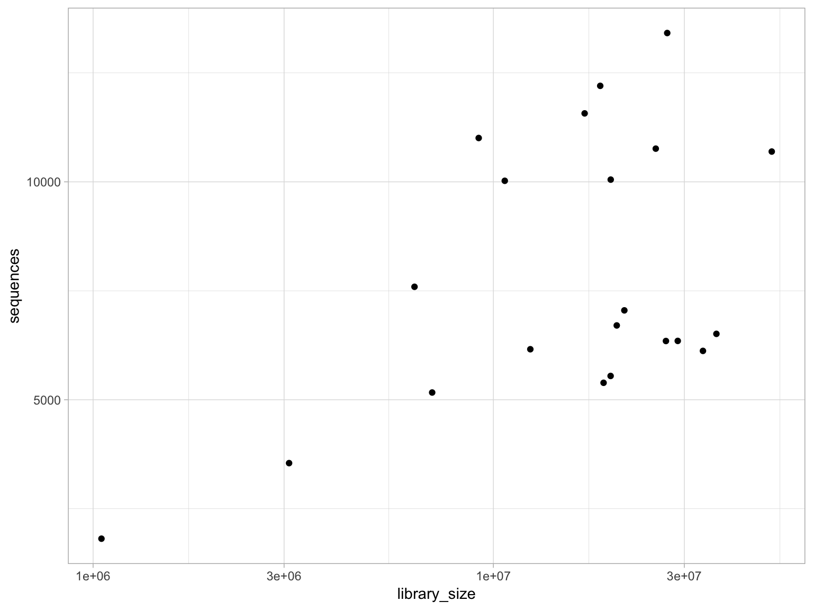

-   How many isomiRs per miRNA

``` r
R> filter(ranked, value >= 1) %>% dplyr::count(sample, mir, iso_loss) %>% ggplot(aes(x = sample, 
+     y = n)) + geom_boxplot() + theme(axis.text.x = element_text(angle = 90, 
+     hjust = 1, vjust = 0.5)) + facet_wrap(~iso_loss)
```


-   Abundance importance for each isomiR/Reference found

``` r
R> # Importance of isomiRs
R> ggplot(filter(ranked, rank < 10), aes(x = as.factor(rank), y = pct)) + geom_boxplot() + 
+     facet_wrap(~sample)
```

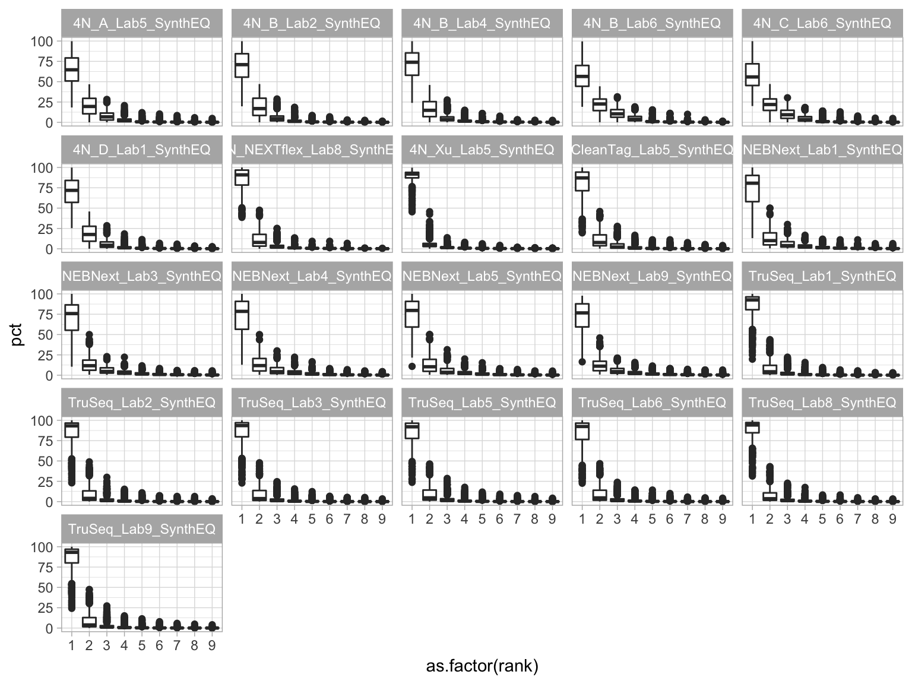

-   How many isomiRs per type

``` r
R> filter(ranked, value >= 1) %>% dplyr::count(sample, iso) %>% ggplot(aes(x = sample, 
+     y = n)) + geom_bar(stat = "identity") + facet_wrap(~iso, nrow = 4) + theme(axis.text.x = element_text(angle = 90, 
+     hjust = 1, vjust = 0.5))
```

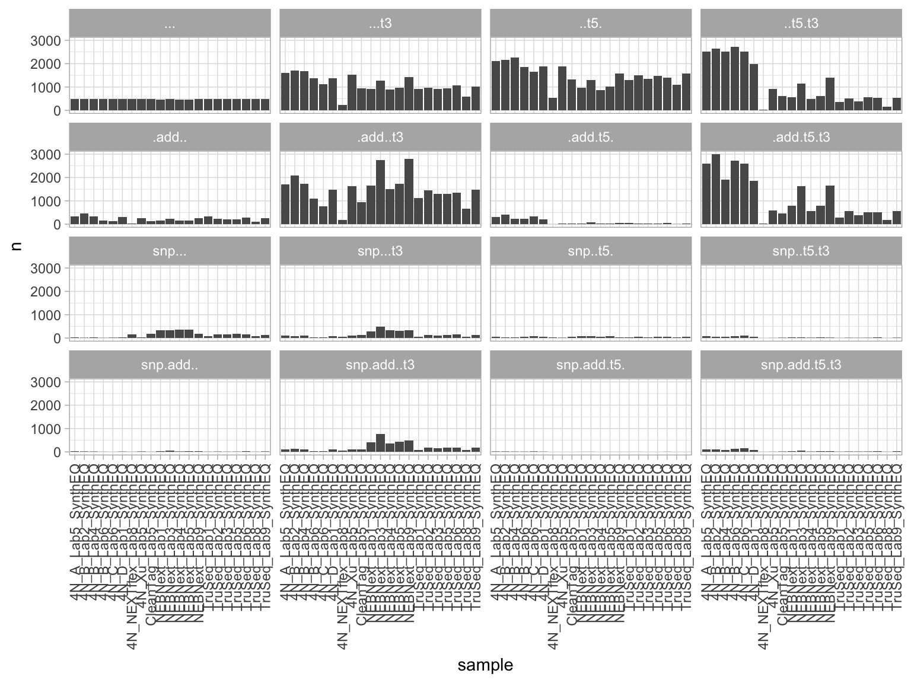

-   From the miRNAs where the reference is the most expressed, what is the percentage of the isomiR expression from the total miRNA expression

``` r
R> ranked %>% filter(ref_is_1 == 1) %>% group_by(sample, mir) %>% ggplot(aes(x = sample, 
+     fill = pct_cat)) + geom_bar() + facet_wrap(~iso, nrow = 4) + theme(axis.text.x = element_text(angle = 90, 
+     hjust = 1, vjust = 0.5))
```


-   From the miRNAs where the reference is the most expressed, Example of highly expressed isomiRs (&gt;40% of the miRNA family) and its reference

``` r
R> ex = ranked %>% group_by(sample, mir) %>% mutate(ref_is_1 = length(mir[rank == 
+     1 & iso == "..."])) %>% ungroup %>% filter(ref_is_1 == 1, pct > 40, rank > 
+     1) %>% group_by(sample, mir) %>% arrange(sample, mir, desc(normalized)) %>% 
+     ungroup() %>% unite("seqid", seq, iso_nt) %>% select(sample, normalized, 
+     seqid) %>% spread("sample", "normalized", fill = 0)
R> ma = log2(as.matrix(ex[, 2:20]) + 1)
R> rownames(ma) = ex$seqid
R> pheatmap(ma, clustering_method = "ward.D2", clustering_distance_rows = "correlation", 
+     clustering_distance_cols = "correlation", fontsize_row = 4)
```

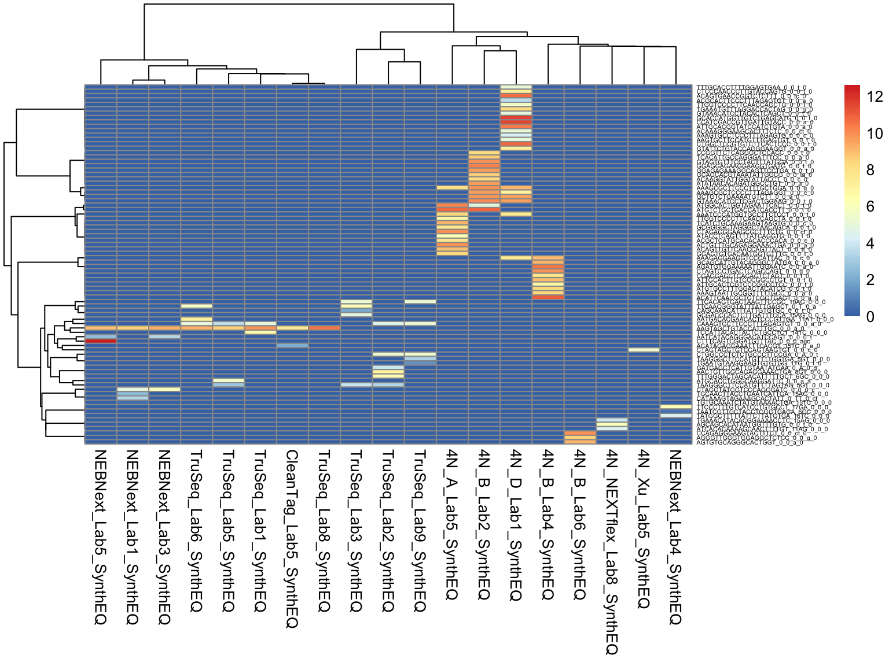

-   From the miRNAs where the reference is the most expressed, isomiR types that are &gt; 20% of the miRNA family

``` r
R> ranked %>% filter(ref_is_1 == 1, pct > 20, rank > 1) %>% group_by(sample, mir) %>% 
+     arrange(sample, mir, desc(normalized)) %>% ungroup() %>% unite("seqid", 
+     seq, iso_nt) %>% distinct(protocol, seqid, iso) %>% dplyr::count(protocol, 
+     iso) %>% ggplot(aes(x = protocol, y = n)) + geom_bar(stat = "identity") + 
+     facet_wrap(~iso, nrow = 4) + theme(axis.text.x = element_text(angle = 90, 
+     hjust = 1, vjust = 0.5))
```

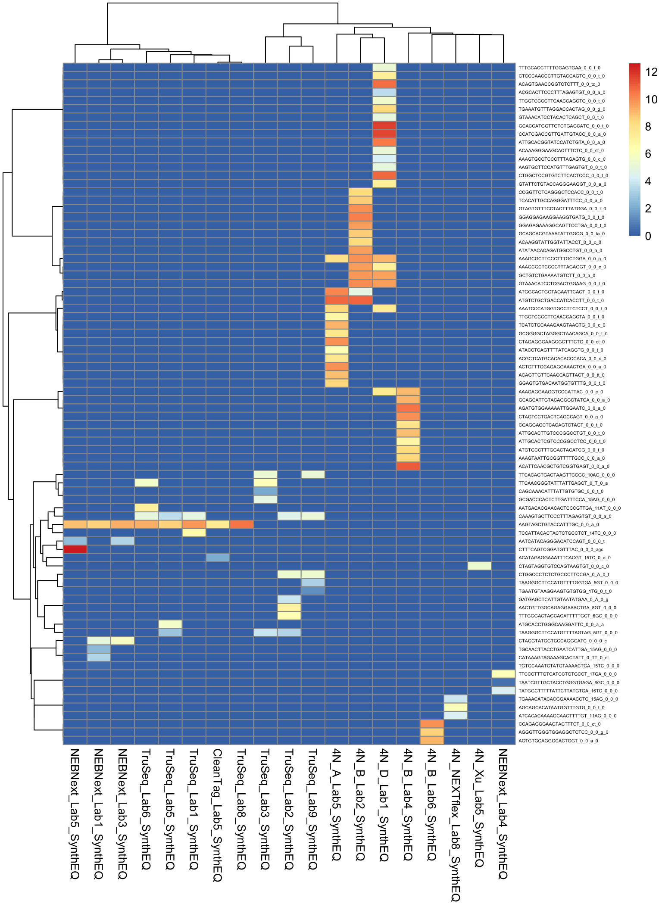

-   From miRNAs where the reference is NOT the most expressed, what types the top 1st isomiRs are

``` r
R> ranked %>% filter(ref_is_1 != 1, rank == 1) %>% ggplot(aes(sample)) + geom_bar() + 
+     facet_wrap(~iso) + theme(axis.text.x = element_text(angle = 90, hjust = 1, 
+     vjust = 0.5))
```

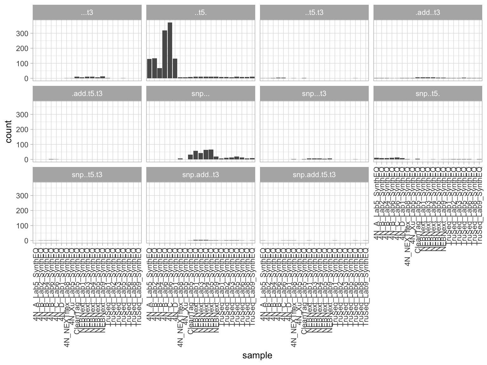

-   From miRNAs where the reference is NOT the most expressed, what normalized expression the top 1st isomiRs have

``` r
R> ex = ranked %>% filter(ref_is_1 != 1, rank == 1, !grepl("4N_[ABCD]", sample), 
+     iso != "snp...") %>% unite("seqid", mir, seq, iso_nt) %>% select(sample, 
+     normalized, seqid) %>% spread("sample", "normalized", fill = 0) %>% as.data.frame() %>% 
+     column_to_rownames("seqid") %>% as.matrix()
R> 
R> pheatmap(log2(ex + 1), fontsize_row = 3)
```

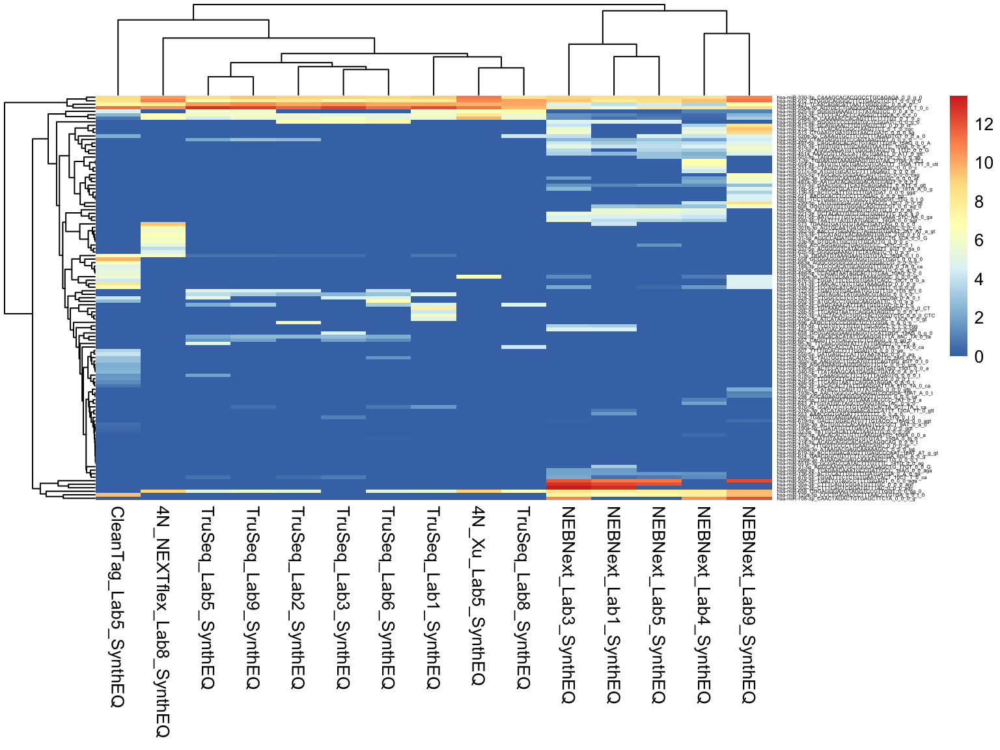

APPENDIX
--------

-   From the miRNAs where the reference is the most expressed, From the miRNAs where the reference is the most expressed, what is the percentage of the isomiR expression from the total miRNA expression only looking at trimming

``` r
R> ranked %>% filter(ref_is_1 == 1) %>% filter(iso == "...t3" | iso == "..t5." | 
+     iso == "..t5.t3") %>% ggplot(aes(x = sample, fill = iso_loss)) + geom_bar() + 
+     facet_wrap(~pct_cat, nrow = 4) + theme(axis.text.x = element_text(angle = 90, 
+     hjust = 1, vjust = 0.5))
```

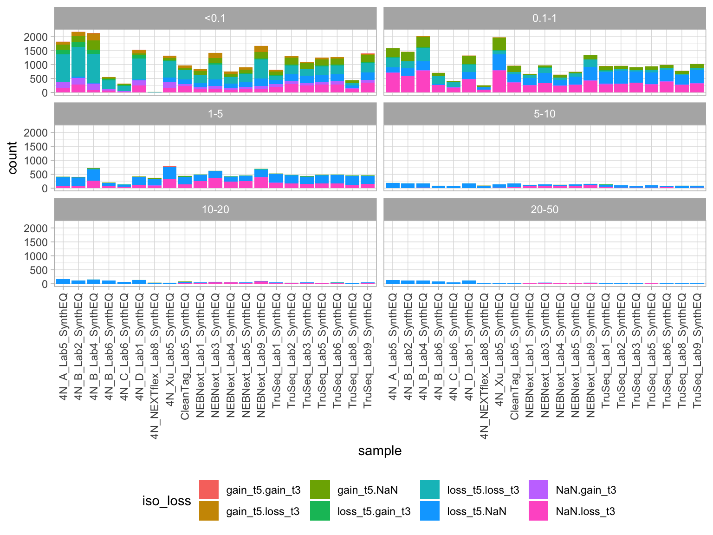

-   How many isomiRs per miRNA expression

``` r
R> filter(ranked, value >= 1) %>% group_by(sample, mir) %>% mutate(n_isomirs = n()) %>% 
+     ggplot(aes(x = n_isomirs, y = log2(value + 1), color = protocol)) + geom_point(alpha = 0.3) + 
+     facet_wrap(~sample)
```

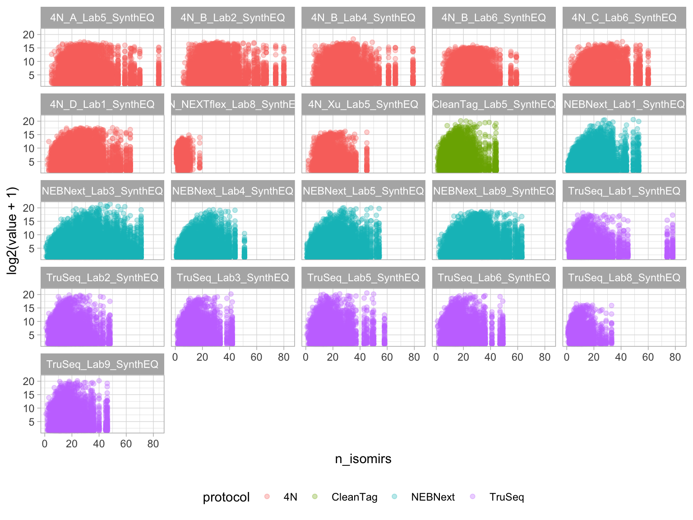

-   How many isomiRs per type detected by the four technologies, only looking at trimming events

``` r
R> filter(ranked, value >= 1, iso_loss != "NaN") %>% distinct(iso, mir, iso_loss, 
+     seq, reproducible_protocol) %>% dplyr::count(iso, reproducible_protocol, 
+     iso_loss) %>% ggplot(aes(x = reproducible_protocol, y = n)) + geom_bar(stat = "identity") + 
+     facet_wrap(~iso_loss) + theme(axis.text.x = element_text(angle = 90, hjust = 1, 
+     vjust = 0.5))
```

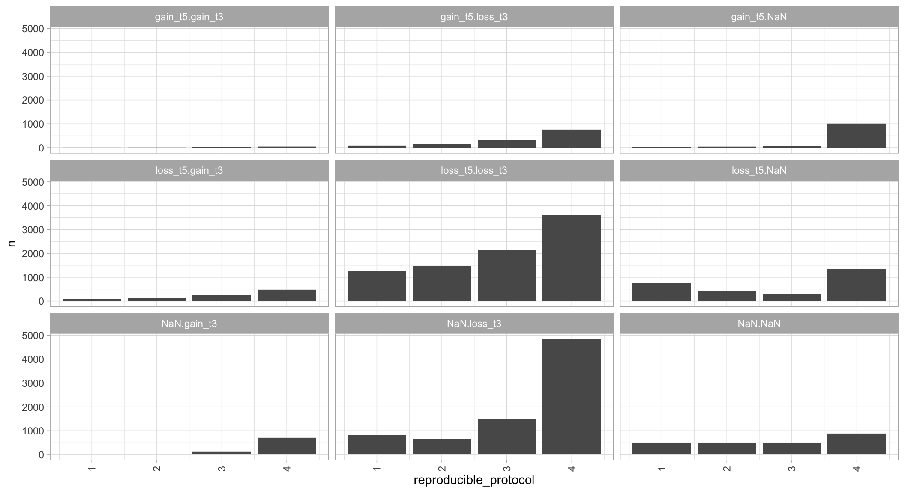

-   How expressed isomiRs are (normalized value)

``` r
R> filter(ranked, normalized >= 1) %>% ggplot(aes(x = sample, y = normalized)) + 
+     geom_boxplot() + facet_wrap(~iso, nrow = 4) + scale_y_log10() + theme(axis.text.x = element_text(angle = 90, 
+     hjust = 1, vjust = 0.5)) + geom_hline(yintercept = 100)
```

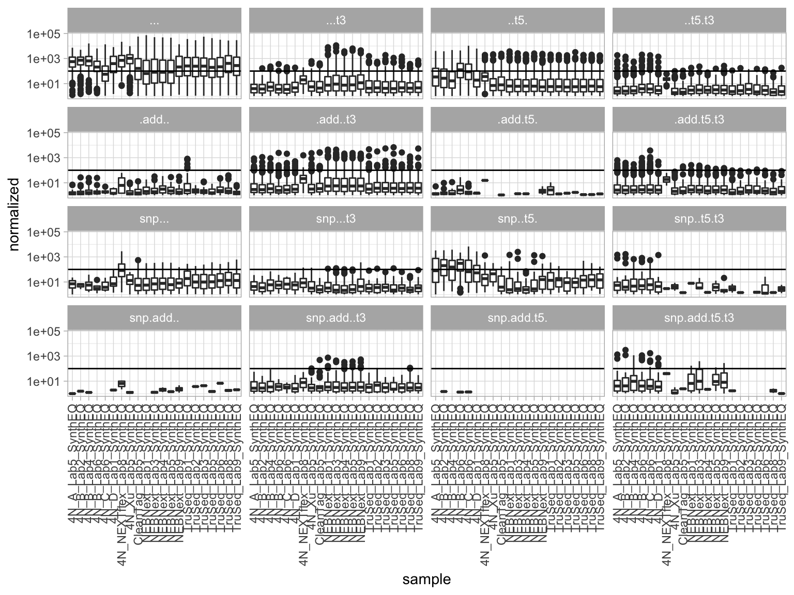

-   How expressed isomiRs as percentage of total miRNA expression

``` r
R> filter(ranked, normalized >= 1) %>% ggplot(aes(x = sample, y = pct)) + geom_boxplot() + 
+     facet_wrap(~iso, nrow = 4) + theme(axis.text.x = element_text(angle = 90, 
+     hjust = 1, vjust = 0.5)) + geom_hline(yintercept = 0.1)
```

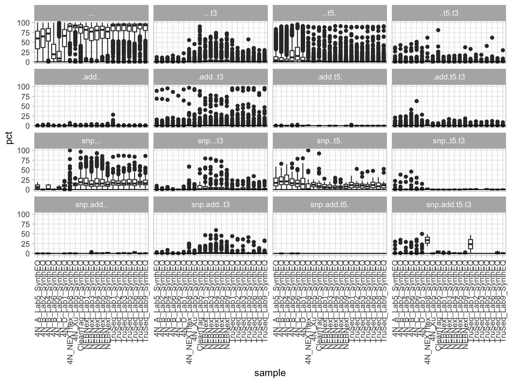

-   What is the abundance position of the reference sequence in each miRNA

``` r
R> # which position the reference has in each sample
R> ggplot(filter(ranked, !is.na(id)), aes(rank)) + geom_bar() + facet_wrap(~sample)
```


-   Which isomiRs is the second most expressed with more than 20% of expression from the total of the miRNA

``` r
R> ranked %>% filter(ref_is_1 == 1, rank != 1, pct > 20) %>% ggplot(aes(sample)) + 
+     geom_bar() + facet_wrap(~iso_loss, nrow = 4) + theme(axis.text.x = element_text(angle = 90, 
+     hjust = 1, vjust = 0.5))
```

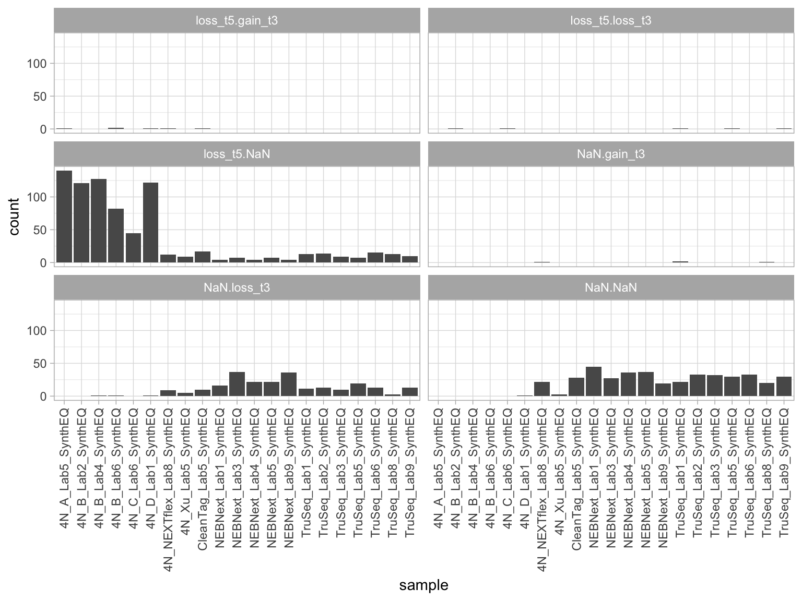

-   Example of hsa-miR-200a-5p with reference and isomiRs

``` r
R> # example of miR where top isomiRs are consistent among some protocols
R> ex = ranked %>% filter(mir == "hsa-miR-200a-5p") %>% group_by(sample, mir) %>% 
+     arrange(sample, mir, desc(value)) %>% filter(rank > 0) %>% ungroup() %>% 
+     unite("seqid", seq, iso_nt) %>% select(sample, value, seqid) %>% spread("sample", 
+     "value", fill = 0)
R> ma = log2(as.matrix(ex[, 2:22]) + 1)
R> rownames(ma) = ex$seqid
R> pheatmap(ma, clustering_method = "ward.D2", clustering_distance_rows = "correlation", 
+     clustering_distance_cols = "correlation", fontsize_row = 4)
```

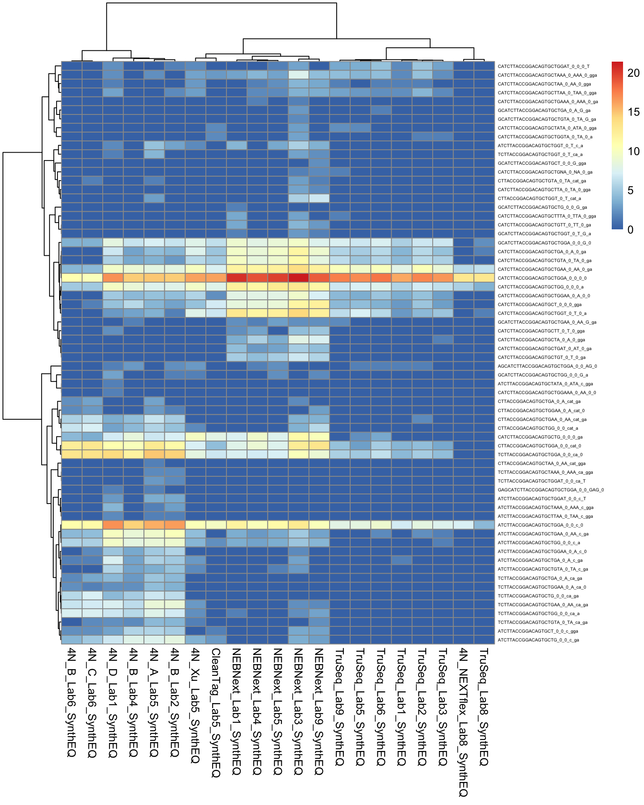

-   isomiRs with &gt; 20% of the miRNA familiy

``` r
R> ex = ranked %>% group_by(sample, mir) %>% mutate(ref_is_1 = length(mir[rank == 
+     1 & iso == "..."])) %>% ungroup %>% filter(ref_is_1 == 1, pct > 20, rank > 
+     1) %>% group_by(sample, mir) %>% arrange(sample, mir, desc(normalized)) %>% 
+     ungroup() %>% unite("seqid", seq, iso_nt) %>% select(sample, normalized, 
+     seqid) %>% spread("sample", "normalized", fill = 0)
R> ma = log2(as.matrix(ex[, 2:22]) + 1)
R> rownames(ma) = ex$seqid
R> pheatmap(ma, clustering_method = "ward.D2", clustering_distance_rows = "correlation", 
+     clustering_distance_cols = "correlation", show_rownames = FALSE)
```


``` r
R> library(isomiRs)
R> isoPlot(ids, type = "all", column = "protocol")
```
