``` r
library(knitr)
library(ggplot2)
library(pheatmap)

# Set seed for reproducibility
set.seed(1454944673L)

opts_chunk[["set"]](
    autodep = TRUE,
    bootstrap.show.code = FALSE,
    cache = TRUE,
    cache.lazy = TRUE,
    dev = c("png", "pdf"),
    error = TRUE,
    fig.height = 6,
    fig.retina = 2L,
    fig.width = 8,
    highlight = TRUE,
    message = FALSE,
    prompt = TRUE,
    # formatR required for tidy code
    tidy = TRUE,
    warning = FALSE,
    results = 'asis')

theme_set(
    theme_light(base_size = 11L))
theme_update(
    legend.justification = "center",
    legend.position = "bottom")
```

Data analyzed
=============

-   equimolar Tewari: bcbio, miRge and razer3
-   custom equimolar Tewari: razer3
-   custom Van Dijk: razer3
-   plasma: bcbio, miRge

Filtering applied:
------------------

-   Only using sequences that map to miRNAs that are in the miRXplore sample or spike-ins defined by the project
-   miRNAs that didn't contain one sequence being inside the miRXplore or spike-ins space were removed
-   Only sequences that mapped once to a reference were kept

Conclusion
==========

The majority of miRNAs had the reference sequences as top expressed.

The majority of isomiRs correspon to trimming events.

The majority are losses/truncation.

4N generetes more trimming events.

Results
=======

``` r
R> library(tidyverse)
R> library(ggplot2)
R> 
R> load(params$data)
```

-   From the miRNAs where the reference is the most expressed, what is the percentage of the isomiR expression from the total miRNA expression

``` r
R> equimolar %>% filter(ref_is_1 == 1) %>% ggplot(aes(x = short, fill = pct_cat)) + 
+     geom_bar() + facet_wrap(~iso, nrow = 4, scales = "free_y") + theme(axis.text.x = element_text(angle = 90, 
+     hjust = 1, vjust = 0.5)) + ggtitle("equimolar - bcbio")
```

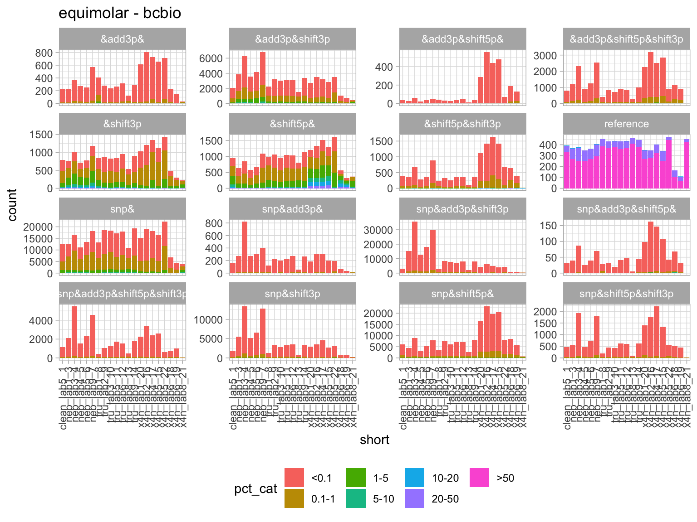

``` r
R> equimolar_mirge %>% filter(ref_is_1 == 1) %>% group_by(short, mi_rna) %>% ggplot(aes(x = short, 
+     fill = pct_cat)) + geom_bar() + facet_wrap(~iso, nrow = 4, scales = "free_y") + 
+     theme(axis.text.x = element_text(angle = 90, hjust = 1, vjust = 0.5)) + 
+     ggtitle("equimolar - mirge2.0")
```

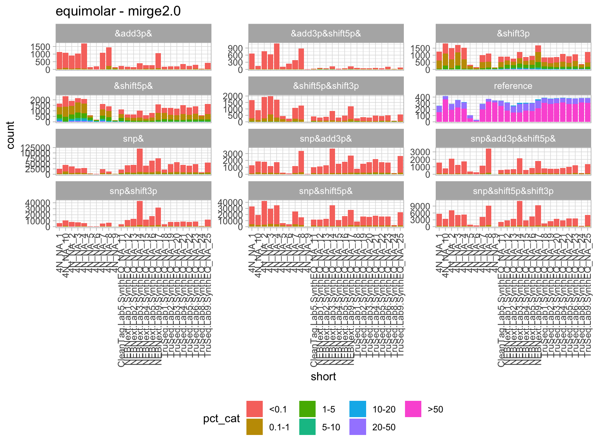

``` r
R> equimolar_razer3 %>% filter(ref_is_1 == 1) %>% group_by(short, mi_rna) %>% ggplot(aes(x = short, 
+     fill = pct_cat)) + geom_bar() + facet_wrap(~iso, nrow = 4, scales = "free_y") + 
+     theme(axis.text.x = element_text(angle = 90, hjust = 1, vjust = 0.5)) + 
+     ggtitle("equimolar - razer3")
```

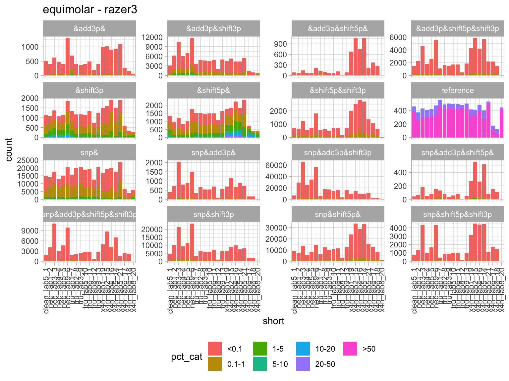

``` r
R> custom %>% filter(ref_is_1 == 1) %>% ggplot(aes(x = short, fill = pct_cat)) + 
+     geom_bar() + facet_wrap(~iso, nrow = 4, scales = "free_y") + theme(axis.text.x = element_text(angle = 90, 
+     hjust = 1, vjust = 0.5)) + ggtitle("custom - razer3")
```

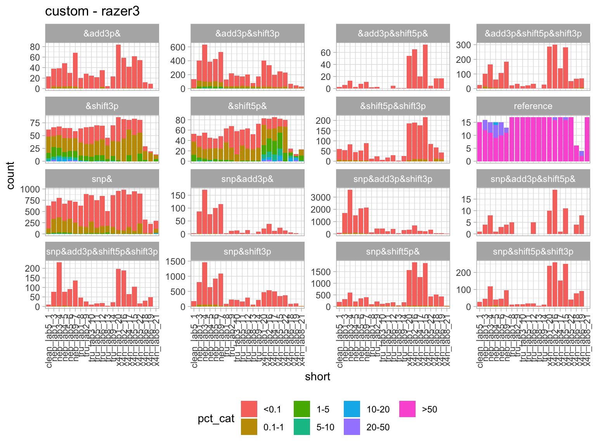

``` r
R> vandijk %>% filter(ref_is_1 == 1) %>% ggplot(aes(x = short, fill = pct_cat)) + 
+     geom_bar() + facet_wrap(~iso, nrow = 4, scales = "free_y") + theme(axis.text.x = element_text(angle = 90, 
+     hjust = 1, vjust = 0.5)) + ggtitle("VanDijk - razer3")
```

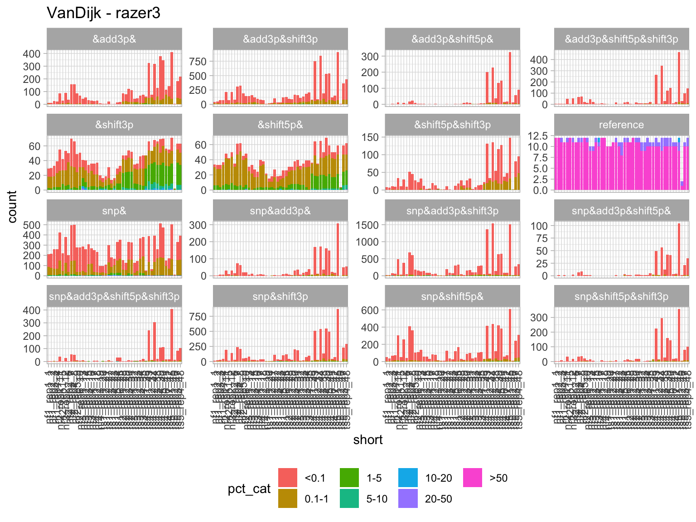

``` r
R> plasma %>% filter(ref_is_1 == 1) %>% ggplot(aes(x = short, fill = pct_cat)) + 
+     geom_bar() + facet_wrap(~iso, nrow = 4, scales = "free_y") + theme(axis.text.x = element_text(angle = 90, 
+     hjust = 1, vjust = 0.5)) + ggtitle("plasma - bcbio")
```

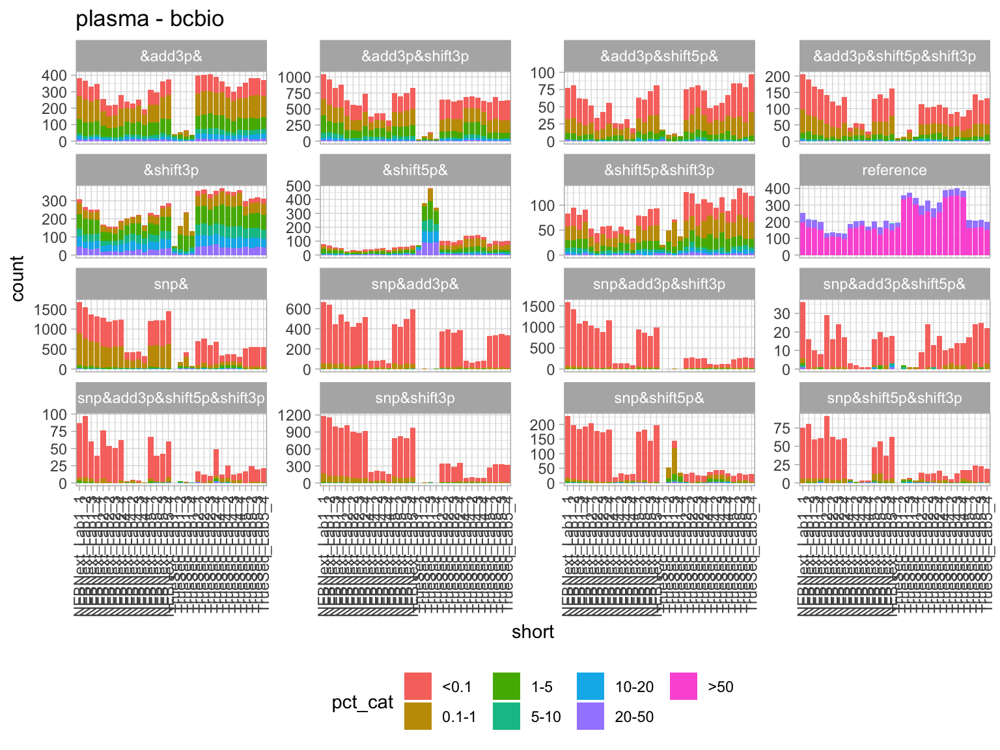

Same thing but using seqThreshold to keep sequences.

``` r
R> equimolar %>% filter(ref_is_1 == 1, value > threshold) %>% ggplot(aes(x = short, 
+     fill = pct_cat)) + geom_bar() + facet_wrap(~iso, nrow = 4, scales = "free_y") + 
+     theme(axis.text.x = element_text(angle = 90, hjust = 1, vjust = 0.5)) + 
+     ggtitle("equimolar - bcbio")
```

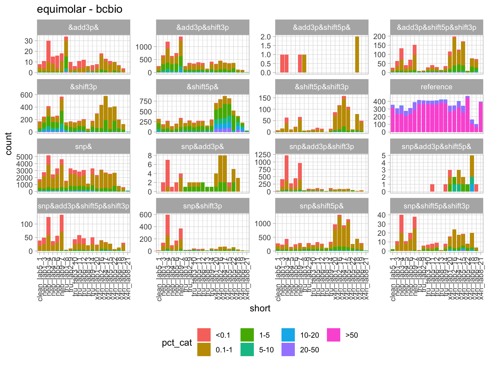

``` r
R> equimolar_mirge %>% filter(ref_is_1 == 1, value > threshold) %>% group_by(short, 
+     mi_rna) %>% ggplot(aes(x = short, fill = pct_cat)) + geom_bar() + facet_wrap(~iso, 
+     nrow = 4, scales = "free_y") + theme(axis.text.x = element_text(angle = 90, 
+     hjust = 1, vjust = 0.5)) + ggtitle("equimolar - mirge2.0")
```

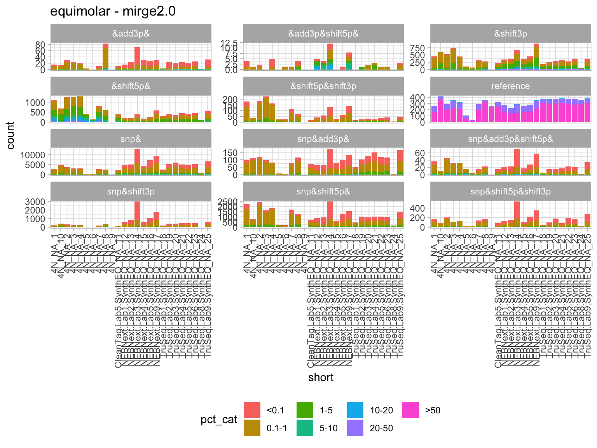

``` r
R> equimolar_razer3 %>% filter(ref_is_1 == 1, value > threshold) %>% group_by(short, 
+     mi_rna) %>% ggplot(aes(x = short, fill = pct_cat)) + geom_bar() + facet_wrap(~iso, 
+     nrow = 4, scales = "free_y") + theme(axis.text.x = element_text(angle = 90, 
+     hjust = 1, vjust = 0.5)) + ggtitle("equimolar - razer3")
```

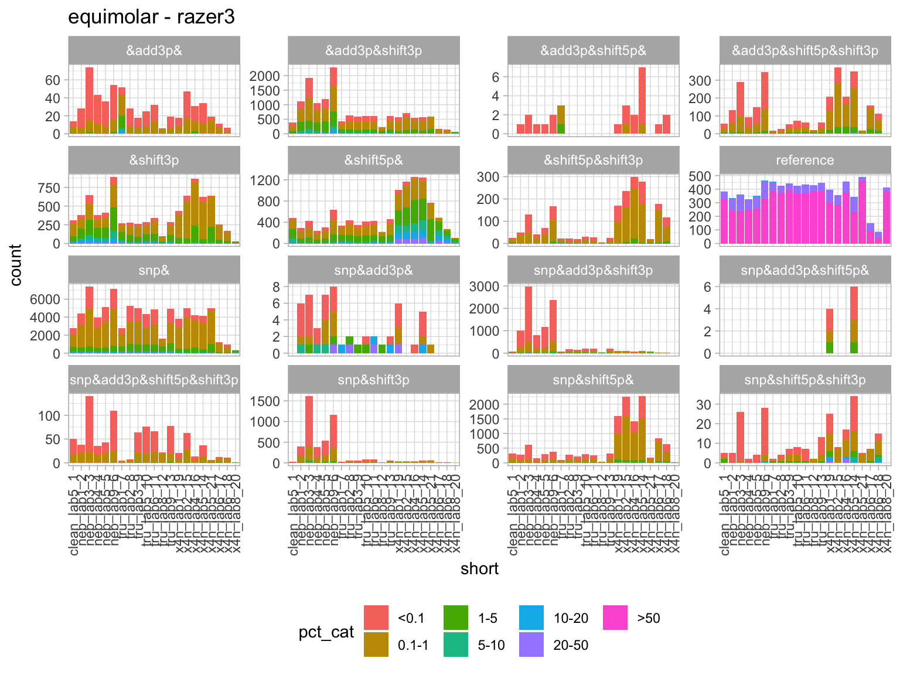

``` r
R> custom %>% filter(ref_is_1 == 1, value > threshold) %>% ggplot(aes(x = short, 
+     fill = pct_cat)) + geom_bar() + facet_wrap(~iso, nrow = 4, scales = "free_y") + 
+     theme(axis.text.x = element_text(angle = 90, hjust = 1, vjust = 0.5)) + 
+     ggtitle("custom - razer3")
```

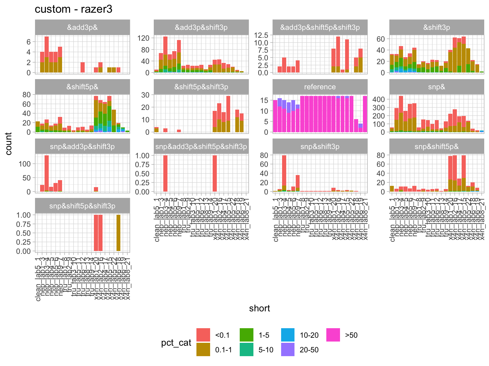

``` r
R> vandijk %>% filter(ref_is_1 == 1, value > threshold) %>% ggplot(aes(x = short, 
+     fill = pct_cat)) + geom_bar() + facet_wrap(~iso, nrow = 4, scales = "free_y") + 
+     theme(axis.text.x = element_text(angle = 90, hjust = 1, vjust = 0.5)) + 
+     ggtitle("VanDijk - razer3")
```

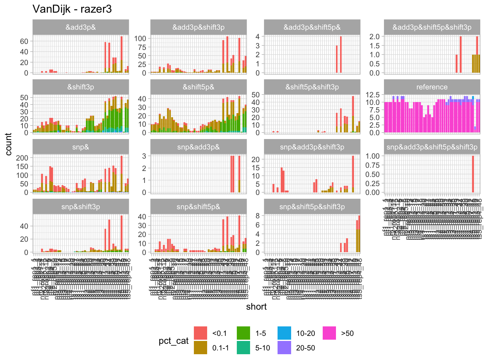

``` r
R> plasma %>% filter(ref_is_1 == 1, value > threshold) %>% ggplot(aes(x = short, 
+     fill = pct_cat)) + geom_bar() + facet_wrap(~iso, nrow = 4, scales = "free_y") + 
+     theme(axis.text.x = element_text(angle = 90, hjust = 1, vjust = 0.5)) + 
+     ggtitle("plasma - bcbio")
```

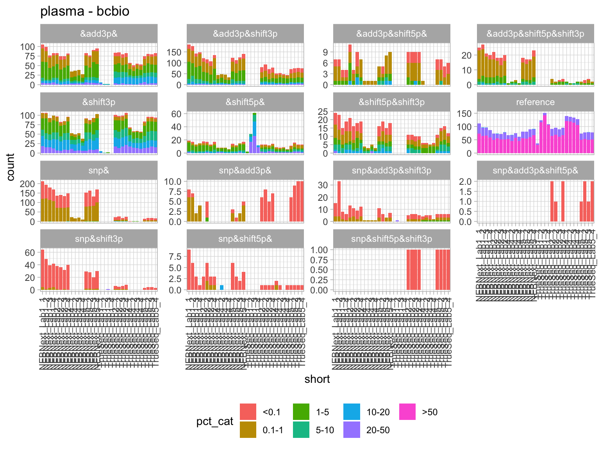

Same thing but normalizing by number of total sequences detected in each sample.

``` r
R> prepare = . %>% filter(ref_is_1 == 1) %>% dplyr::count(short, pct_cat, iso) %>% 
+     group_by(short) %>% mutate(pct_total = n/sum(n) * 100)
R> 
R> equimolar %>% prepare() %>% ggplot(aes(x = short, fill = pct_cat, y = pct_total)) + 
+     geom_bar(stat = "identity") + facet_wrap(~iso, nrow = 4, scales = "free_y") + 
+     theme(axis.text.x = element_text(angle = 90, hjust = 1, vjust = 0.5)) + 
+     ggtitle("equimolar - bcbio")
```

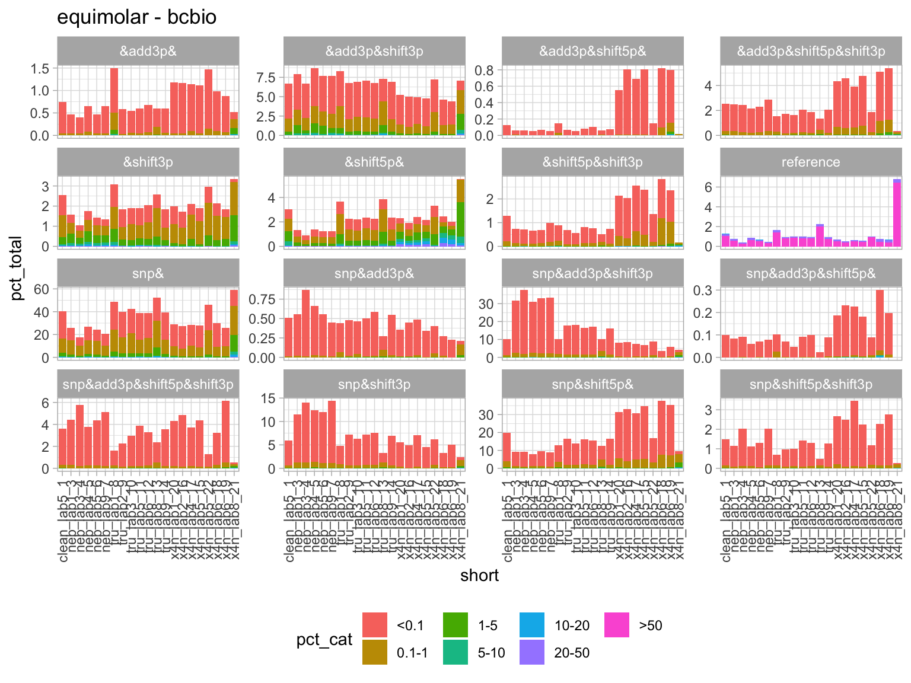

``` r
R> equimolar_mirge %>% prepare() %>% ggplot(aes(x = short, fill = pct_cat, y = pct_total)) + 
+     geom_bar(stat = "identity") + facet_wrap(~iso, nrow = 4, scales = "free_y") + 
+     theme(axis.text.x = element_text(angle = 90, hjust = 1, vjust = 0.5)) + 
+     ggtitle("equimolar - mirge2.0")
```

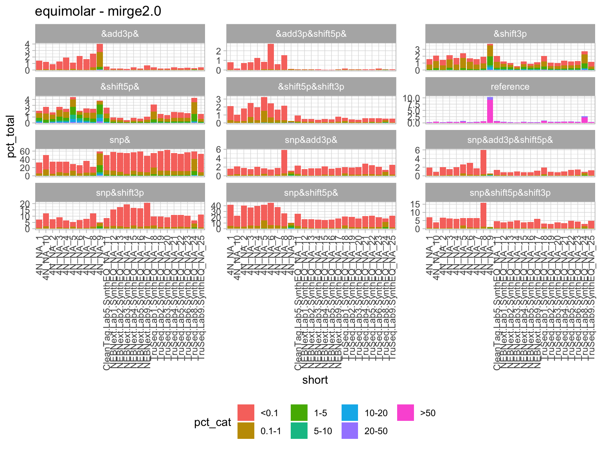

``` r
R> equimolar_razer3 %>% prepare() %>% ggplot(aes(x = short, fill = pct_cat, y = pct_total)) + 
+     geom_bar(stat = "identity") + facet_wrap(~iso, nrow = 4, scales = "free_y") + 
+     theme(axis.text.x = element_text(angle = 90, hjust = 1, vjust = 0.5)) + 
+     ggtitle("equimolar - razer3")
```

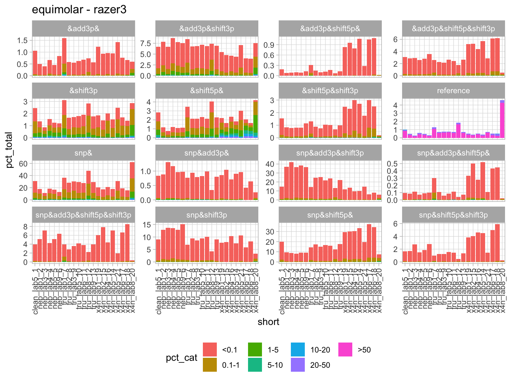

``` r
R> custom %>% prepare() %>% ggplot(aes(x = short, fill = pct_cat, y = pct_total)) + 
+     geom_bar(stat = "identity") + facet_wrap(~iso, nrow = 4, scales = "free_y") + 
+     theme(axis.text.x = element_text(angle = 90, hjust = 1, vjust = 0.5)) + 
+     ggtitle("custom - razer3")
```

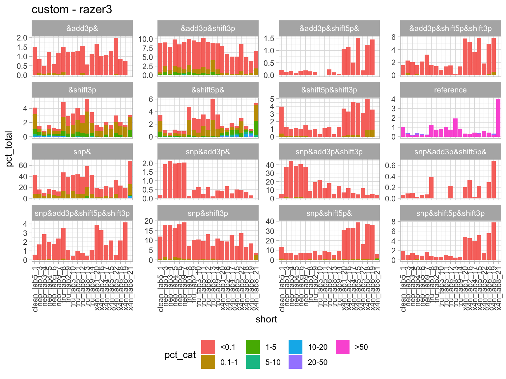

``` r
R> vandijk %>% prepare() %>% ggplot(aes(x = short, fill = pct_cat, y = pct_total)) + 
+     geom_bar(stat = "identity") + facet_wrap(~iso, nrow = 4, scales = "free_y") + 
+     theme(axis.text.x = element_text(angle = 90, hjust = 1, vjust = 0.5)) + 
+     ggtitle("VanDijk - razer3")
```

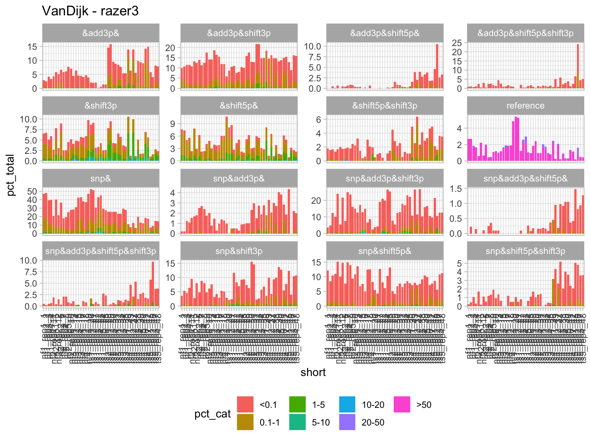

``` r
R> plasma %>% prepare() %>% ggplot(aes(x = short, fill = pct_cat, y = pct_total)) + 
+     geom_bar(stat = "identity") + facet_wrap(~iso, nrow = 4, scales = "free_y") + 
+     theme(axis.text.x = element_text(angle = 90, hjust = 1, vjust = 0.5)) + 
+     ggtitle("plasma - bcbio")
```

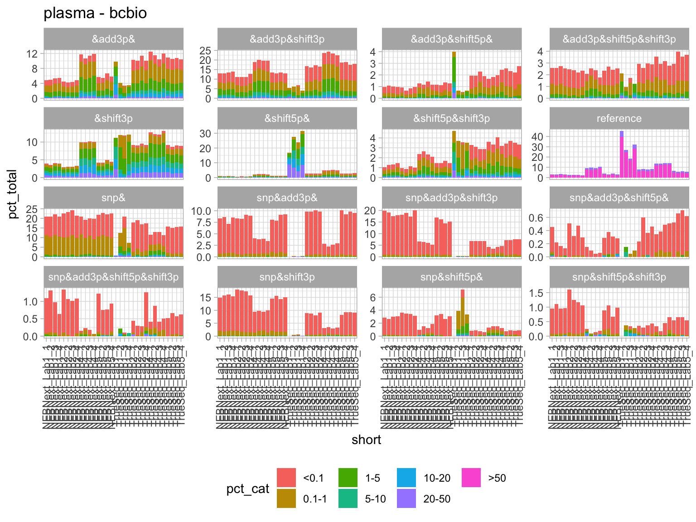

-   From the miRNAs where the reference is the most expressed, what is the percentage of the isomiR expression from the total miRNA expression, only looking at iso\_5p and iso\_3p

``` r
R> equimolar %>% filter(ref_is_1 == 1, iso_shift_nt != "0", (iso == "&shift5p&" | 
+     iso == "&shift3p")) %>% ggplot(aes(x = short, fill = pct_cat)) + geom_bar() + 
+     facet_wrap(~iso_shift_nt, nrow = 4, scales = "free_y") + theme(axis.text.x = element_text(angle = 90, 
+     hjust = 1, vjust = 0.5)) + ggtitle("equimolar - bcbio")
```

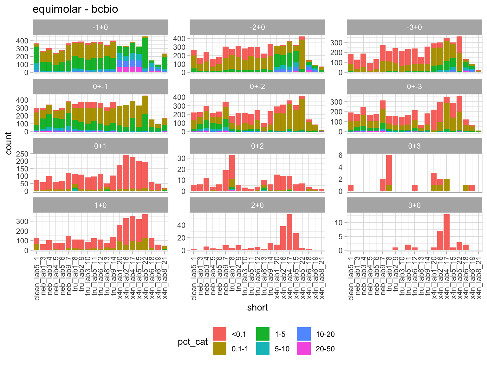

``` r
R> plasma %>% filter(ref_is_1 == 1, iso_shift_nt != "0", (iso == "&shift5p&" | 
+     iso == "&shift3p")) %>% ggplot(aes(x = short, fill = pct_cat)) + geom_bar() + 
+     facet_wrap(~iso_shift_nt, nrow = 4, scales = "free_y") + theme(axis.text.x = element_text(angle = 90, 
+     hjust = 1, vjust = 0.5)) + ggtitle("plasma - bcbio")
```

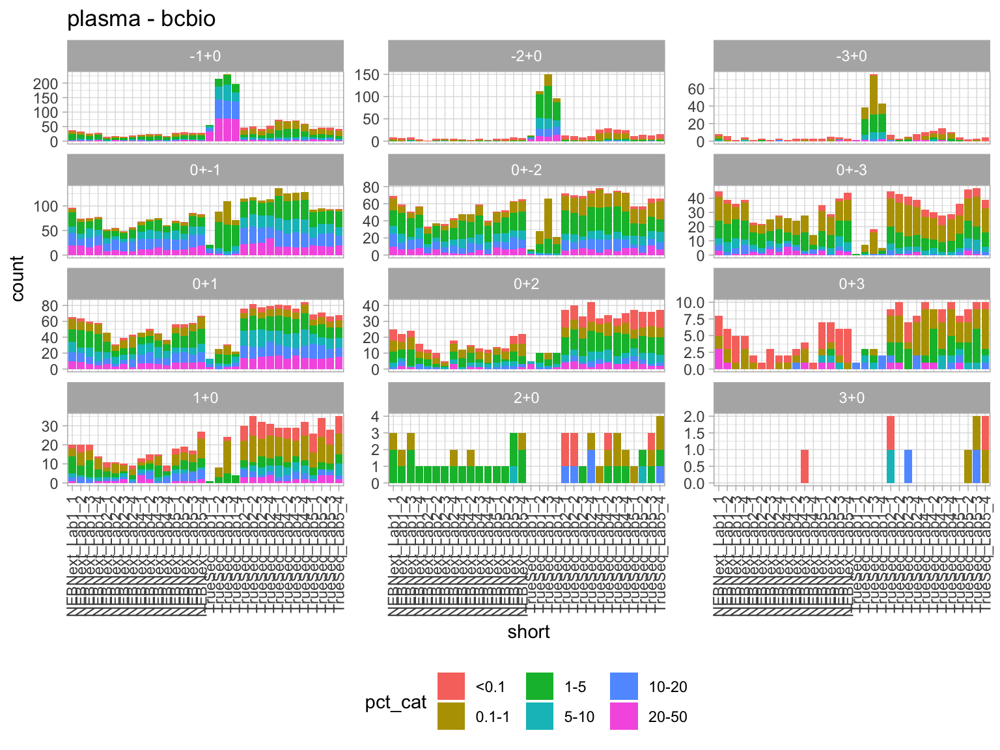

``` r
R> custom %>% filter(ref_is_1 == 1, iso_shift_nt != "0", (iso == "&shift5p&" | 
+     iso == "&shift3p")) %>% ggplot(aes(x = short, fill = pct_cat)) + geom_bar() + 
+     facet_wrap(~iso_shift_nt, nrow = 4, scales = "free_y") + theme(axis.text.x = element_text(angle = 90, 
+     hjust = 1, vjust = 0.5)) + ggtitle("custom - razer3")
```

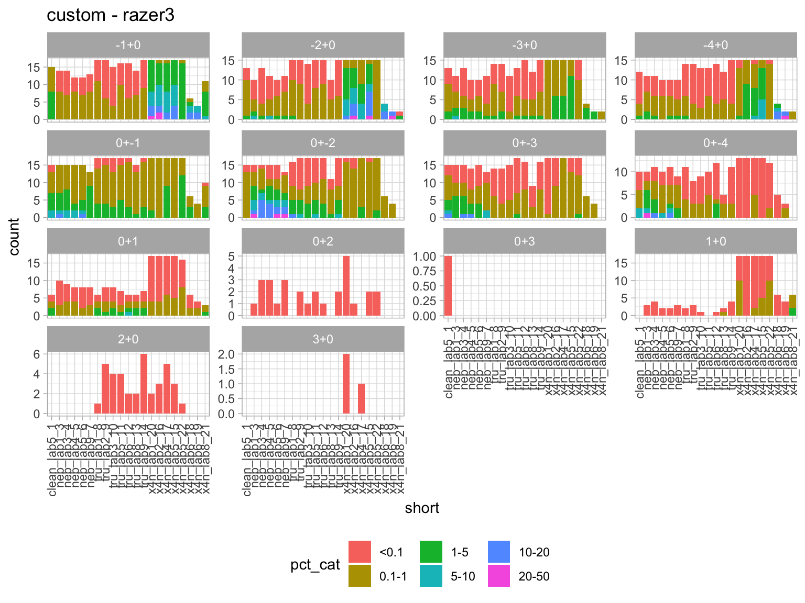

``` r
R> vandijk %>% filter(ref_is_1 == 1, iso_shift_nt != "0", (iso == "&shift5p&" | 
+     iso == "&shift3p")) %>% ggplot(aes(x = short, fill = pct_cat)) + geom_bar() + 
+     facet_wrap(~iso_shift_nt, nrow = 4, scales = "free_y") + theme(axis.text.x = element_text(angle = 90, 
+     hjust = 1, vjust = 0.5)) + ggtitle("VanDijk - razer3")
```

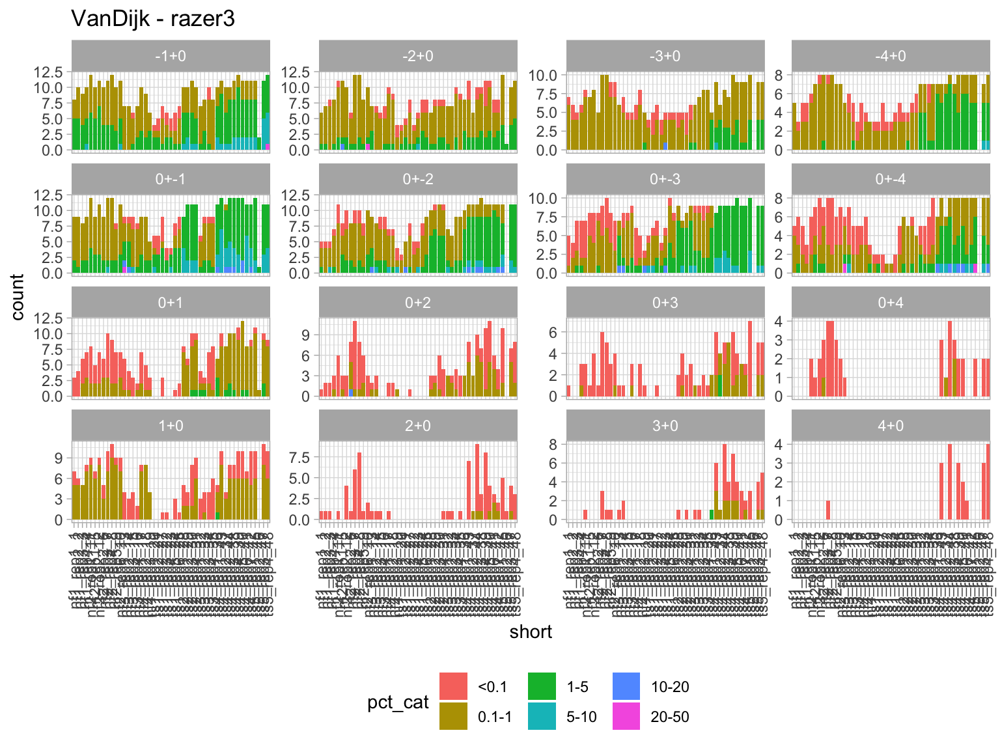

``` r
R> equimolar_mirge %>% filter(ref_is_1 == 1, iso_shift_nt != "0", (iso == "&shift5p&" | 
+     iso == "&shift3p")) %>% ggplot(aes(x = short, fill = pct_cat)) + geom_bar() + 
+     facet_wrap(~iso_shift_nt, nrow = 4, scales = "free_y") + theme(axis.text.x = element_text(angle = 90, 
+     hjust = 1, vjust = 0.5)) + ggtitle("equimolar - mirge2.0")
```

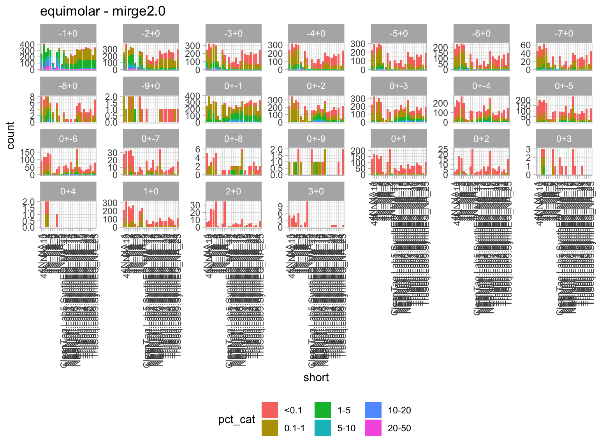
