``` r
library(knitr)
library(ggplot2)
library(pheatmap)

# Set seed for reproducibility
set.seed(1454944673L)

opts_chunk[["set"]](
    autodep = TRUE,
    bootstrap.show.code = FALSE,
    cache = TRUE,
    cache.lazy = TRUE,
    dev = c("png", "pdf"),
    error = TRUE,
    fig.height = 6,
    fig.retina = 2L,
    fig.width = 8,
    highlight = TRUE,
    message = FALSE,
    prompt = TRUE,
    # formatR required for tidy code
    tidy = TRUE,
    warning = FALSE,
    results = 'asis')

theme_set(
    theme_light(base_size = 11L))
theme_update(
    legend.justification = "center",
    legend.position = "bottom")
```

``` r
R> library(tidyverse)
R> library(ggplot2)
R> 
R> load(params$data)
```

Equimolar samples from tewari et al paper was analyzed with bcbio and processed with isomiRs Bioconductor pakcage. This will remove sequences with only 1 read, sequences with nt changes with a frequency &lt; 10% in the miRNA family will be considered error sequencing and non-template additions that are not U or A are removed.

Extra filtering applied:

-   only using sequences that map to miRNAs that are in the miRXplore sample and were identified in miRBase 21 (510 miRNA are the maximum to be detected)
-   Only human sequences were used. (7 miRNAs and their isomiRs weren't detected in any sample)
-   miRNAs that didn't contain one sequence being inside the miRXplore sample were removed (13 miRNAs with their isomiRs were removed)
-   samples from human plasma were added in the same way here.

Conclusion
==========

The majority of miRNAs had the reference sequences as top expressed.

The majority of isomiRs correspon to trimming events.

4N generetes more trimming events.

When using only miRNAs that the top expressed sequence is the reference (miRXplore sequence), the majority of isomiRs where low expressed compared to that sequence abundance (&lt;20% of the total miRNA expression, except for 4N protocol).

Help
====

-   `add` means non-template additions
-   `t3` and `t5` means trimming events
-   `snp` means nt changes
-   id for sequences are: `sequence` \_ `snp` \_ `add` \_ `t3` \_ `t5`
-   table is in `results/ranked.rda` object
-   `annotate_with_mirx_data.R` was used to load and parse the data according the previous filters.

Data
====

Data is in stored in the file `data/data_gff.rda`. When you `load(file)` in R, you'll see two tables. `equimolar` and `plasma`, both of them in the same format and with the same columns.

[download R object](https://www.dropbox.com/sh/ikt994m56qxf8ju/AADMmnYEMUkzgvXBAN0CUeaha?dl=1).

Questions
=========

-   How many samples by lab and protocol

``` r
R> distinct(equimolar, sample, lab, protocol) %>% dplyr::count(protocol, lab) %>% 
+     kable()
```

| protocol | lab  |    n|
|:---------|:-----|----:|
| clean    | lab5 |    1|
| neb      | lab1 |    1|
| neb      | lab3 |    1|
| neb      | lab4 |    1|
| neb      | lab5 |    1|
| neb      | lab9 |    1|
| tru      | lab1 |    1|
| tru      | lab2 |    1|
| tru      | lab3 |    1|
| tru      | lab5 |    1|
| tru      | lab6 |    1|
| tru      | lab8 |    1|
| tru      | lab9 |    1|
| x4n      | lab1 |    1|
| x4n      | lab2 |    1|
| x4n      | lab4 |    1|
| x4n      | lab5 |    2|
| x4n      | lab6 |    2|
| x4n      | lab8 |    1|

``` r
R> distinct(plasma, sample, lab, protocol) %>% dplyr::count(protocol, lab) %>% 
+     kable()
```

| protocol | lab  |    n|
|:---------|:-----|----:|
| NEBNext  | Lab1 |    4|
| NEBNext  | Lab2 |    4|
| NEBNext  | Lab4 |    4|
| NEBNext  | Lab5 |    4|
| TrueSeq  | Lab1 |    4|
| TrueSeq  | Lab2 |    4|
| TrueSeq  | Lab4 |    4|
| TrueSeq  | Lab5 |    4|

-   Library size

``` r
R> group_by(equimolar, short) %>% summarise(library_size = sum(value, na.rm = T)) %>% 
+     kable()
```

| short          |  library\_size|
|:---------------|--------------:|
| clean\_lab5\_1 |       19381124|
| neb\_lab1\_2   |       21540554|
| neb\_lab3\_3   |       53490591|
| neb\_lab4\_4   |       13201555|
| neb\_lab5\_5   |       22807581|
| neb\_lab9\_6   |       28329145|
| tru\_lab1\_7   |        7113635|
| tru\_lab2\_8   |       29941922|
| tru\_lab3\_9   |       20282293|
| tru\_lab5\_10  |       34492239|
| tru\_lab6\_11  |       27807739|
| tru\_lab8\_12  |        3211878|
| tru\_lab9\_13  |       37220532|
| x4n\_lab1\_19  |       20345548|
| x4n\_lab2\_15  |       28278566|
| x4n\_lab4\_16  |       17572322|
| x4n\_lab5\_14  |       19277125|
| x4n\_lab5\_21  |        6620738|
| x4n\_lab6\_17  |        9701868|
| x4n\_lab6\_18  |       11318232|
| x4n\_lab8\_20  |        1088840|

``` r
R> group_by(plasma, short) %>% summarise(library_size = sum(value, na.rm = T)) %>% 
+     kable()
```

| short            |  library\_size|
|:-----------------|--------------:|
| NEBNext\_Lab1\_1 |        1930521|
| NEBNext\_Lab1\_2 |        1889454|
| NEBNext\_Lab1\_3 |        1433473|
| NEBNext\_Lab1\_4 |        1353045|
| NEBNext\_Lab2\_1 |        2167615|
| NEBNext\_Lab2\_2 |        1979487|
| NEBNext\_Lab2\_3 |        2081153|
| NEBNext\_Lab2\_4 |        1956943|
| NEBNext\_Lab4\_1 |         204520|
| NEBNext\_Lab4\_2 |         206224|
| NEBNext\_Lab4\_3 |         213182|
| NEBNext\_Lab4\_4 |         152238|
| NEBNext\_Lab5\_1 |        1624996|
| NEBNext\_Lab5\_2 |        1768449|
| NEBNext\_Lab5\_3 |        1234416|
| NEBNext\_Lab5\_4 |        1717720|
| TrueSeq\_Lab1\_1 |           5190|
| TrueSeq\_Lab1\_2 |          88249|
| TrueSeq\_Lab1\_3 |         194472|
| TrueSeq\_Lab1\_4 |          48584|
| TrueSeq\_Lab2\_1 |        1357989|
| TrueSeq\_Lab2\_2 |        1357662|
| TrueSeq\_Lab2\_3 |        1157532|
| TrueSeq\_Lab2\_4 |        1284243|
| TrueSeq\_Lab4\_1 |         531926|
| TrueSeq\_Lab4\_2 |         444719|
| TrueSeq\_Lab4\_3 |         465201|
| TrueSeq\_Lab4\_4 |         472502|
| TrueSeq\_Lab5\_1 |        1408378|
| TrueSeq\_Lab5\_2 |        1710484|
| TrueSeq\_Lab5\_3 |        1657975|
| TrueSeq\_Lab5\_4 |        1804772|

-   How many miRNAs has the reference as the top expressed

``` r
R> # % of miRNA which top1 is the reference
R> full_join(dplyr::count(distinct(equimolar, short, mi_rna), short), dplyr::count(filter(equimolar, 
+     rank == 1, !is.na(id)), short), by = "short", suffix = c("_total", "_ref_is_1")) %>% 
+     mutate(pct = n_ref_is_1/n_total * 100) %>% kable()
```

| short          |  n\_total|  n\_ref\_is\_1|    pct|
|:---------------|---------:|--------------:|------:|
| clean\_lab5\_1 |       487|            394|  80.90|
| neb\_lab1\_2   |       487|            367|  75.36|
| neb\_lab3\_3   |       489|            380|  77.71|
| neb\_lab4\_4   |       479|            349|  72.86|
| neb\_lab5\_5   |       487|            362|  74.33|
| neb\_lab9\_6   |       490|            406|  82.86|
| tru\_lab1\_7   |       490|            455|  92.86|
| tru\_lab2\_8   |       490|            435|  88.78|
| tru\_lab3\_9   |       490|            437|  89.18|
| tru\_lab5\_10  |       490|            437|  89.18|
| tru\_lab6\_11  |       490|            437|  89.18|
| tru\_lab8\_12  |       490|            466|  95.10|
| tru\_lab9\_13  |       490|            447|  91.22|
| x4n\_lab1\_19  |       490|            345|  70.41|
| x4n\_lab2\_15  |       490|            345|  70.41|
| x4n\_lab4\_16  |       490|            405|  82.65|
| x4n\_lab5\_14  |       490|            339|  69.18|
| x4n\_lab5\_21  |       490|            478|  97.55|
| x4n\_lab6\_17  |       490|            152|  31.02|
| x4n\_lab6\_18  |       490|             97|  19.80|
| x4n\_lab8\_20  |       484|            455|  94.01|

``` r
R> # % of miRNA which top1 is the reference
R> full_join(dplyr::count(distinct(plasma, short, mi_rna), short), dplyr::count(filter(plasma, 
+     rank == 1, iso == "..."), short), by = "short", suffix = c("_total", "_ref_is_1")) %>% 
+     mutate(pct = n_ref_is_1/n_total * 100) %>% kable()
```

| short            |  n\_total|  n\_ref\_is\_1|    pct|
|:-----------------|---------:|--------------:|------:|
| NEBNext\_Lab1\_1 |       595|            265|  44.54|
| NEBNext\_Lab1\_2 |       586|            221|  37.71|
| NEBNext\_Lab1\_3 |       559|            216|  38.64|
| NEBNext\_Lab1\_4 |       533|            201|  37.71|
| NEBNext\_Lab2\_1 |       364|            138|  37.91|
| NEBNext\_Lab2\_2 |       370|            137|  37.03|
| NEBNext\_Lab2\_3 |       355|            132|  37.18|
| NEBNext\_Lab2\_4 |       399|            129|  32.33|
| NEBNext\_Lab4\_1 |       379|            195|  51.45|
| NEBNext\_Lab4\_2 |       383|            210|  54.83|
| NEBNext\_Lab4\_3 |       398|            209|  52.51|
| NEBNext\_Lab4\_4 |       334|            178|  53.29|
| NEBNext\_Lab5\_1 |       524|            213|  40.65|
| NEBNext\_Lab5\_2 |       487|            173|  35.52|
| NEBNext\_Lab5\_3 |       542|            211|  38.93|
| NEBNext\_Lab5\_4 |       563|            191|  33.93|
| TrueSeq\_Lab1\_1 |       307|            199|  64.82|
| TrueSeq\_Lab1\_2 |       556|            379|  68.17|
| TrueSeq\_Lab1\_3 |       573|            397|  69.28|
| TrueSeq\_Lab1\_4 |       516|            360|  69.77|
| TrueSeq\_Lab2\_1 |       725|            318|  43.86|
| TrueSeq\_Lab2\_2 |       717|            349|  48.67|
| TrueSeq\_Lab2\_3 |       640|            293|  45.78|
| TrueSeq\_Lab2\_4 |       705|            329|  46.67|
| TrueSeq\_Lab4\_1 |       667|            416|  62.37|
| TrueSeq\_Lab4\_2 |       639|            422|  66.04|
| TrueSeq\_Lab4\_3 |       657|            426|  64.84|
| TrueSeq\_Lab4\_4 |       636|            409|  64.31|
| TrueSeq\_Lab5\_1 |       563|            216|  38.37|
| TrueSeq\_Lab5\_2 |       605|            212|  35.04|
| TrueSeq\_Lab5\_3 |       591|            215|  36.38|
| TrueSeq\_Lab5\_4 |       576|            204|  35.42|

-   How many isomiRs per miRNA

``` r
R> filter(equimolar, value >= 1) %>% dplyr::count(short, mi_rna, iso) %>% ggplot(aes(x = short, 
+     y = n)) + geom_boxplot() + theme(axis.text.x = element_text(angle = 90, 
+     hjust = 1, vjust = 0.5)) + facet_wrap(~iso, scales = "free_y") + ggtitle("equimolar")
```

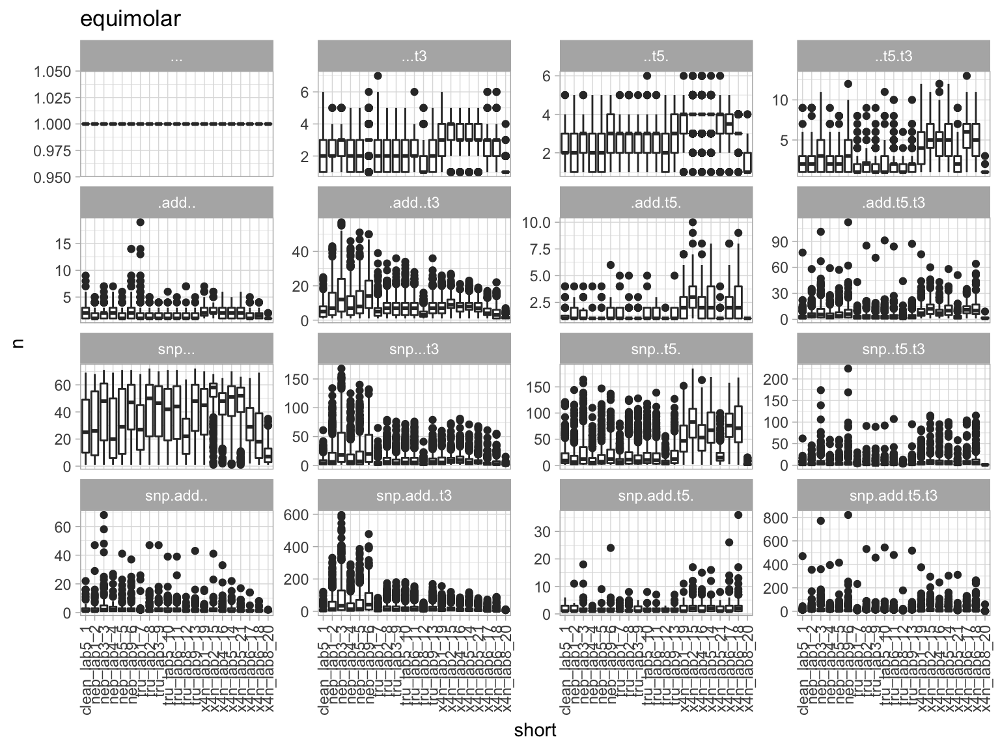

``` r
R> filter(plasma, value >= 1) %>% dplyr::count(short, mi_rna, iso) %>% ggplot(aes(x = short, 
+     y = n)) + geom_boxplot() + theme(axis.text.x = element_text(angle = 90, 
+     hjust = 1, vjust = 0.5)) + facet_wrap(~iso, scales = "free_y") + ggtitle("plasma")
```

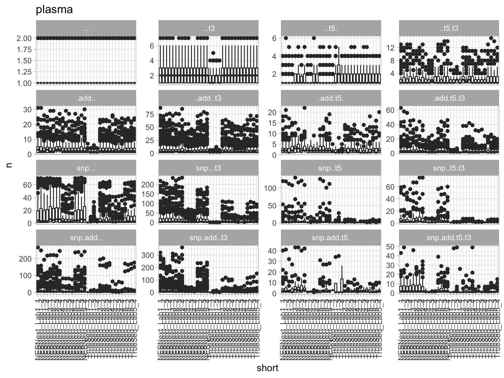

-   Abundance importance for each isomiR/Reference found

``` r
R> # Importance of isomiRs
R> ggplot(filter(equimolar, rank < 10), aes(x = as.factor(rank), y = pct)) + geom_boxplot() + 
+     facet_wrap(~short, scales = "free_y") + ggtitle("equimolar")
```

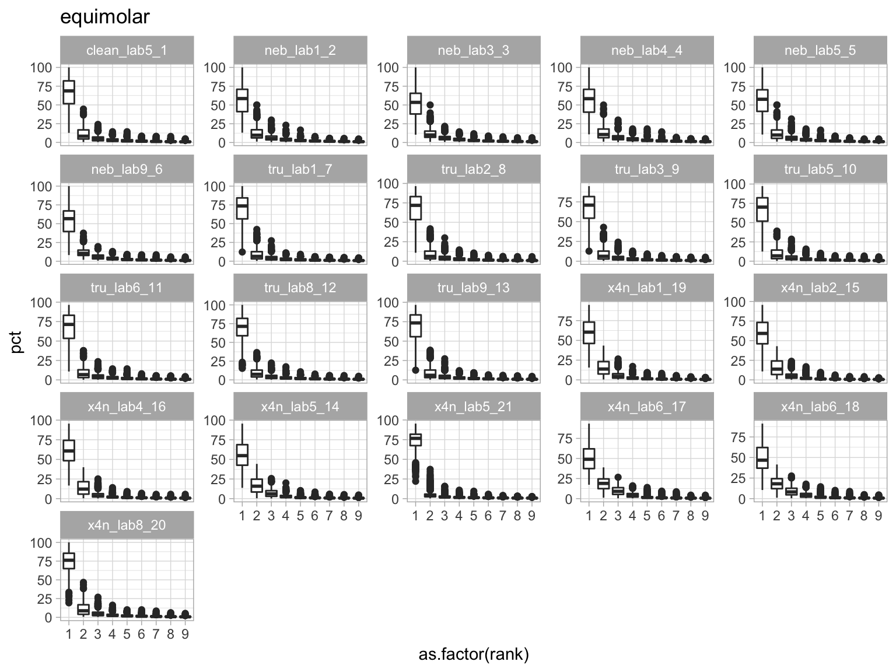

``` r
R> ggplot(filter(plasma, rank < 10), aes(x = as.factor(rank), y = pct)) + geom_boxplot() + 
+     facet_wrap(~short, scales = "free_y") + ggtitle("plasma")
```

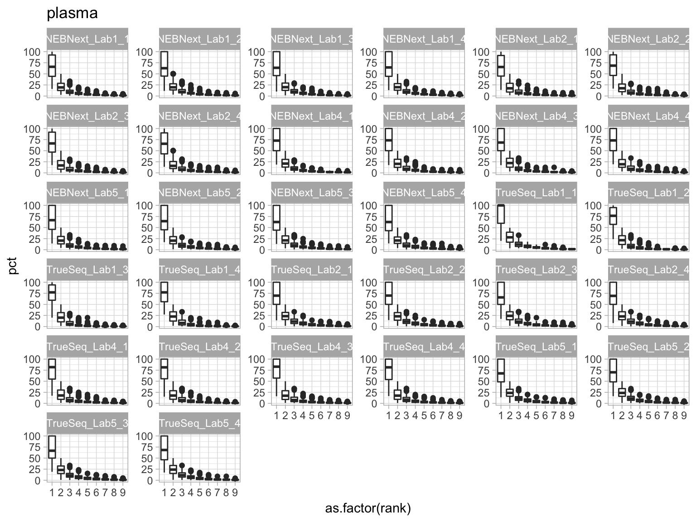

-   How many isomiRs per type

``` r
R> filter(equimolar, normalized >= 1) %>% dplyr::count(short, iso) %>% ggplot(aes(x = short, 
+     y = n)) + geom_bar(stat = "identity") + facet_wrap(~iso, nrow = 4, scales = "free_y") + 
+     theme(axis.text.x = element_text(angle = 90, hjust = 1, vjust = 0.5)) + 
+     ggtitle("equimolar")
```

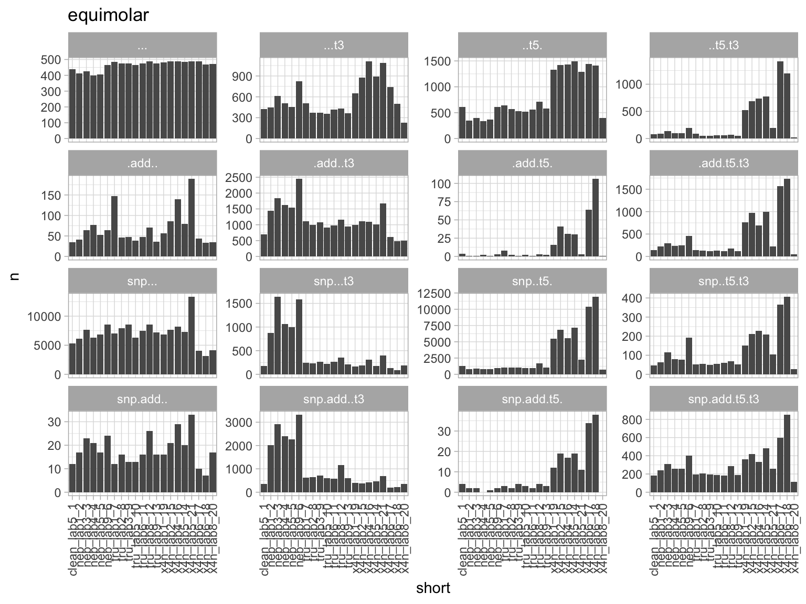

``` r
R> filter(plasma, normalized >= 1) %>% dplyr::count(short, iso) %>% ggplot(aes(x = short, 
+     y = n)) + geom_bar(stat = "identity") + facet_wrap(~iso, nrow = 4, scales = "free_y") + 
+     theme(axis.text.x = element_text(angle = 90, hjust = 1, vjust = 0.5)) + 
+     ggtitle("plasma")
```

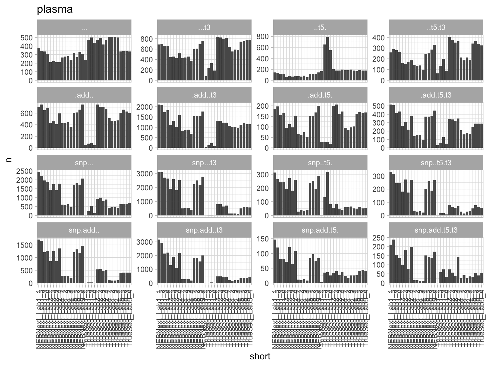

-   From the miRNAs where the reference is the most expressed, what is the percentage of the isomiR expression from the total miRNA expression

``` r
R> equimolar %>% filter(ref_is_1 == 1) %>% group_by(short, mi_rna) %>% ggplot(aes(x = short, 
+     fill = pct_cat)) + geom_bar() + facet_wrap(~iso, nrow = 4, scales = "free_y") + 
+     theme(axis.text.x = element_text(angle = 90, hjust = 1, vjust = 0.5)) + 
+     ggtitle("equimolar")
```

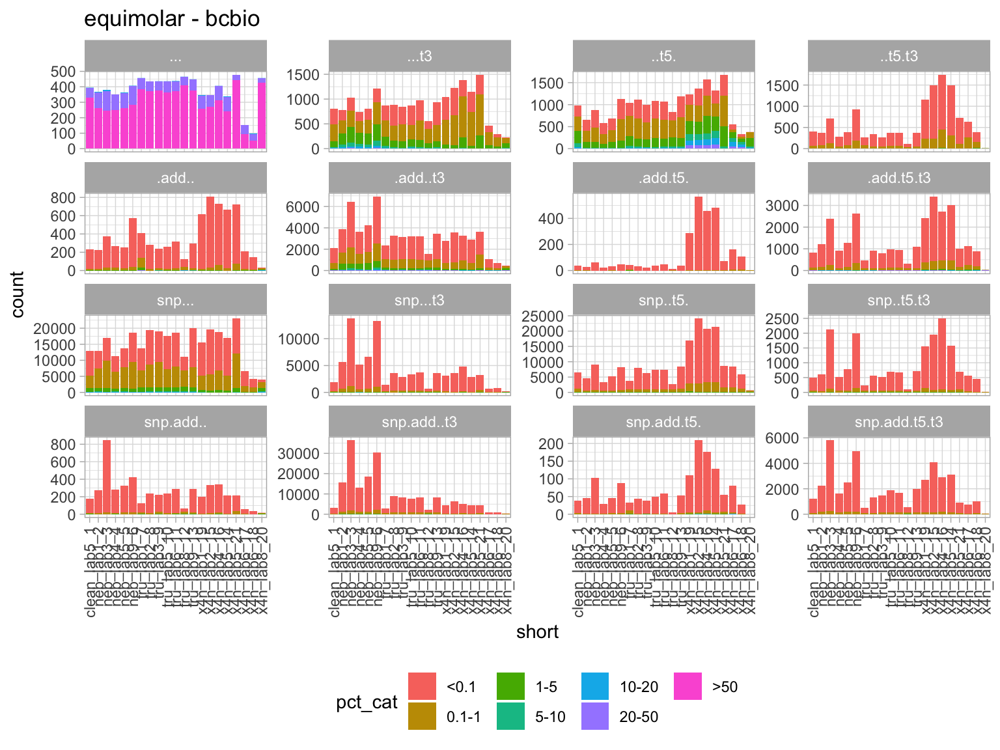

``` r
R> plasma %>% filter(ref_is_1 == 1) %>% group_by(short, mi_rna) %>% ggplot(aes(x = short, 
+     fill = pct_cat)) + geom_bar() + facet_wrap(~iso, nrow = 4, scales = "free_y") + 
+     theme(axis.text.x = element_text(angle = 90, hjust = 1, vjust = 0.5)) + 
+     ggtitle("plasma")
```

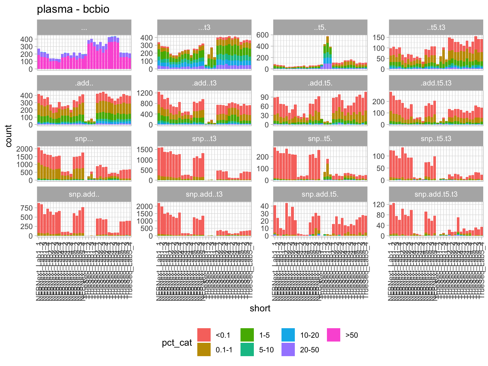

``` r
R> # ranked %>% filter(ref_is_1 == 1, !grepl('snp', iso)) %>% group_by(sample)
R> # %>% mutate(total_isomirs = n()) %>% group_by(protocol, sample, iso,
R> # pct_cat) %>% summarize(pct_sequences = n()/total_isomirs[1]) %>%
R> # ggplot(aes(x = iso, color = pct_cat, y=pct_sequences)) + geom_boxplot() +
R> # facet_wrap(~protocol) + theme(axis.text.x = element_text(angle = 90, hjust
R> # = 1, vjust = 0.5))
```

-   From the miRNAs where the reference is the most expressed, what is the percentage of the isomiR expression from the total miRNA expression by protocol

``` r
R> equimolar %>% filter(ref_is_1 == 1) %>% group_by(read, reproducible_protocol, 
+     iso) %>% summarise(pct_average = mean(pct)) %>% mutate(pct_cat = cut(pct_average, 
+     breaks = c(-1, 0.1, 1, 5, 10, 20, 50, 101), labels = c("<0.1", "0.1-1", 
+         "1-5", "5-10", "10-20", "20-50", ">50"))) %>% ggplot(aes(x = reproducible_protocol, 
+     fill = pct_cat)) + geom_bar() + facet_wrap(~iso, scales = "free_y") + theme(axis.text.x = element_text(angle = 90, 
+     hjust = 1, vjust = 0.5)) + ggtitle("equimolar")
```

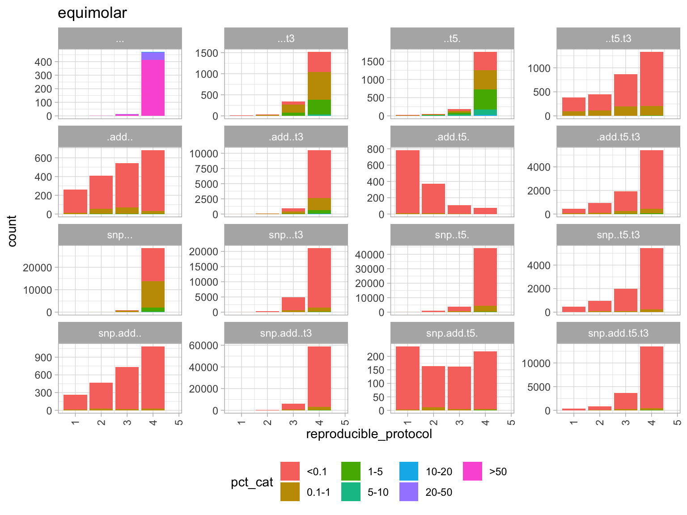

``` r
R> plasma %>% filter(ref_is_1 == 1) %>% group_by(read, reproducible_protocol, iso) %>% 
+     summarise(pct_average = mean(pct)) %>% mutate(pct_cat = cut(pct_average, 
+     breaks = c(-1, 0.1, 1, 5, 10, 20, 50, 101), labels = c("<0.1", "0.1-1", 
+         "1-5", "5-10", "10-20", "20-50", ">50"))) %>% ggplot(aes(x = reproducible_protocol, 
+     fill = pct_cat)) + geom_bar() + facet_wrap(~iso, scales = "free_y") + theme(axis.text.x = element_text(angle = 90, 
+     hjust = 1, vjust = 0.5)) + ggtitle("plasma")
```


-   From the miRNAs where the reference is the most expressed, Example of highly expressed isomiRs (&gt;40% of the miRNA family) and its reference

``` r
R> ex = equimolar %>% filter(ref_is_1 == 1, pct > 30, rank > 1) %>% group_by(short, 
+     mi_rna) %>% arrange(short, mi_rna, desc(normalized)) %>% ungroup() %>% unite("seqid", 
+     read, mi_rna, iso_nt) %>% select(short, normalized, seqid) %>% spread("short", 
+     "normalized", fill = 0)
R> ma = log2(as.matrix(ex[, 2:21]) + 1)
R> rownames(ma) = ex$seqid
R> pheatmap(ma, clustering_method = "ward.D2", clustering_distance_rows = "correlation", 
+     clustering_distance_cols = "correlation", fontsize_row = 4)
```

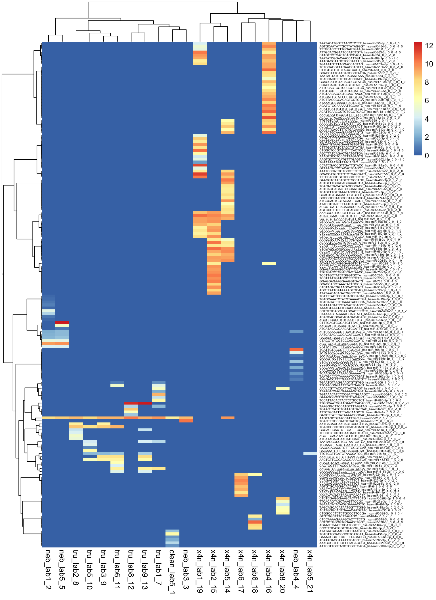

-   From the miRNAs where the reference is the most expressed, isomiR types that are &gt; 20% of the miRNA family

``` r
R> equimolar %>% filter(ref_is_1 == 1, pct > 20, rank > 1) %>% group_by(short, 
+     mi_rna) %>% arrange(short, mi_rna, desc(normalized)) %>% ungroup() %>% unite("seqid", 
+     read, iso_nt) %>% distinct(protocol, seqid, iso) %>% dplyr::count(protocol, 
+     iso) %>% ggplot(aes(x = protocol, y = iso, fill = n)) + geom_tile() + scale_fill_gradientn(colors = c("white", 
+     "black")) + theme(axis.text.x = element_text(angle = 90, hjust = 1, vjust = 0.5)) + 
+     ggtitle("equimolar")
```

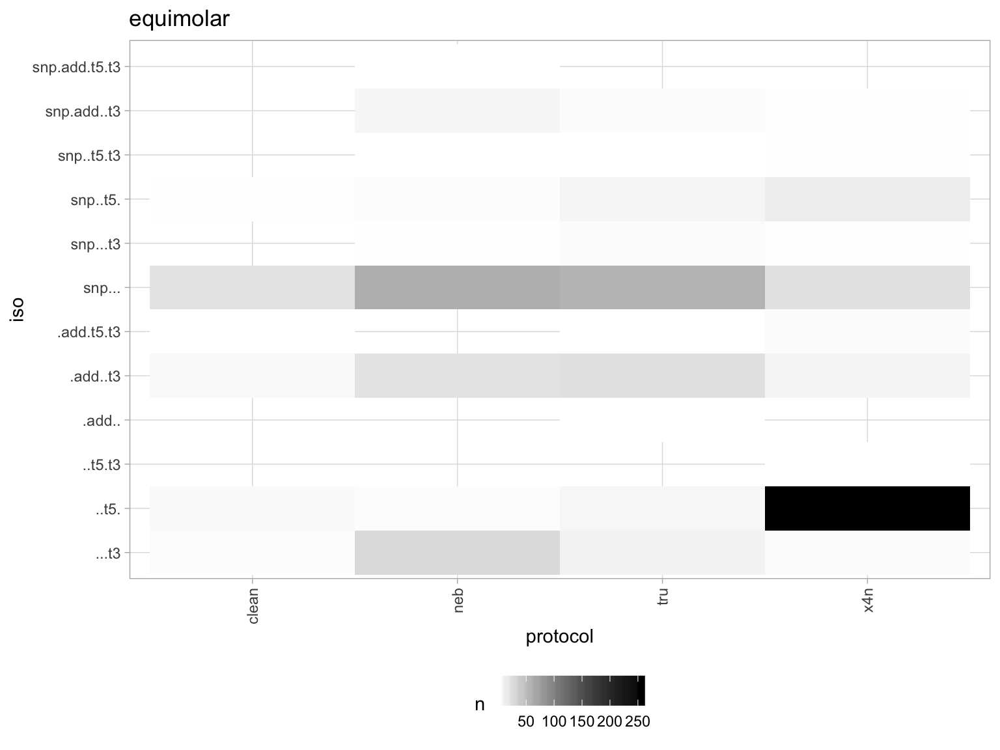

``` r
R> plasma %>% filter(ref_is_1 == 1, pct > 20, rank > 1) %>% group_by(short, mi_rna) %>% 
+     arrange(short, mi_rna, desc(normalized)) %>% ungroup() %>% unite("seqid", 
+     read, iso_nt) %>% distinct(protocol, seqid, iso) %>% dplyr::count(protocol, 
+     iso) %>% ggplot(aes(x = protocol, y = iso, fill = n)) + geom_tile() + scale_fill_gradientn(colors = c("white", 
+     "black")) + theme(axis.text.x = element_text(angle = 90, hjust = 1, vjust = 0.5)) + 
+     ggtitle("plasma")
```

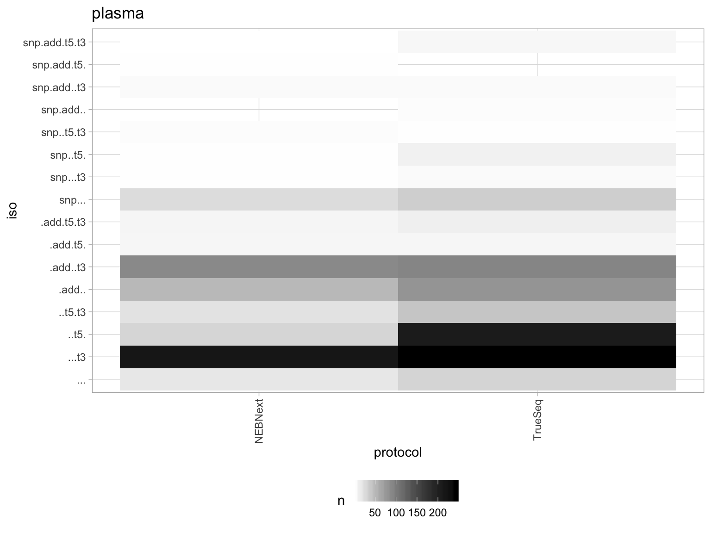

-   From miRNAs where the reference is NOT the most expressed, what types the top 1st isomiRs are

``` r
R> equimolar %>% filter(ref_is_1 != 1, rank == 1) %>% ggplot(aes(short)) + geom_bar() + 
+     facet_wrap(~iso) + theme(axis.text.x = element_text(angle = 90, hjust = 1, 
+     vjust = 0.5)) + ggtitle("equimolar")
```


``` r
R> plasma %>% filter(ref_is_1 != 1, rank == 1) %>% ggplot(aes(short)) + geom_bar() + 
+     facet_wrap(~iso) + theme(axis.text.x = element_text(angle = 90, hjust = 1, 
+     vjust = 0.5)) + ggtitle("plasma")
```

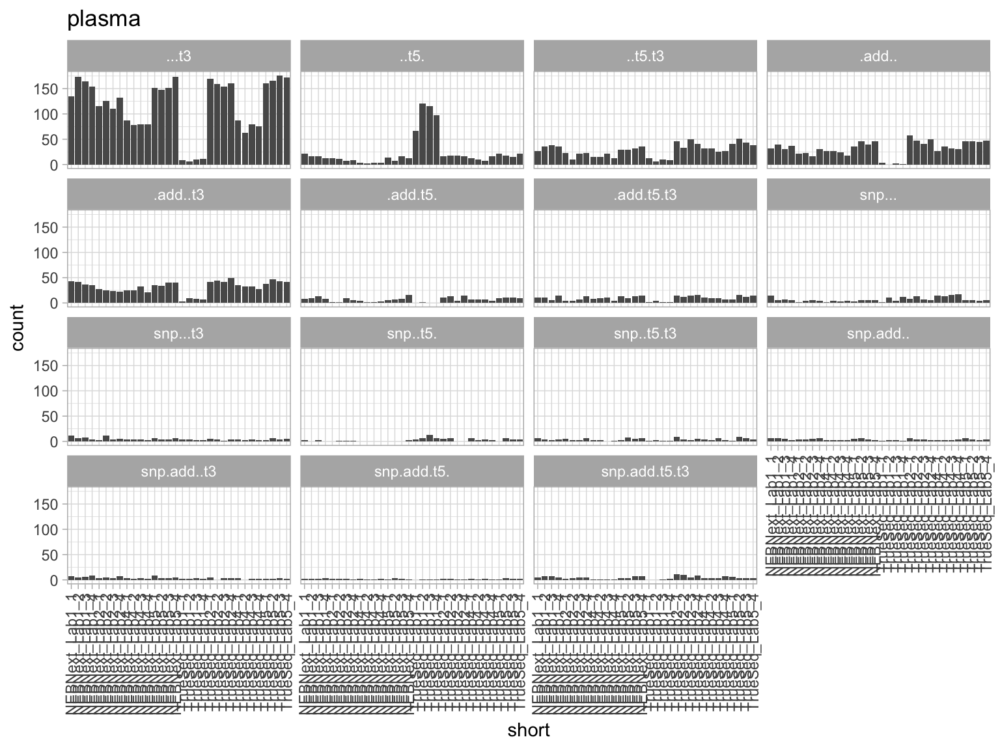

-   From miRNAs where the reference is NOT the most expressed, what is the percentage of the isomiR expression from the total miRNA expression

``` r
R> equimolar %>% filter(ref_is_1 != 1) %>% group_by(short, mi_rna) %>% ggplot(aes(x = short, 
+     fill = pct_cat)) + geom_bar() + facet_wrap(~iso, nrow = 4, scales = "free_y") + 
+     theme(axis.text.x = element_text(angle = 90, hjust = 1, vjust = 0.5)) + 
+     ggtitle("equimolar")
```

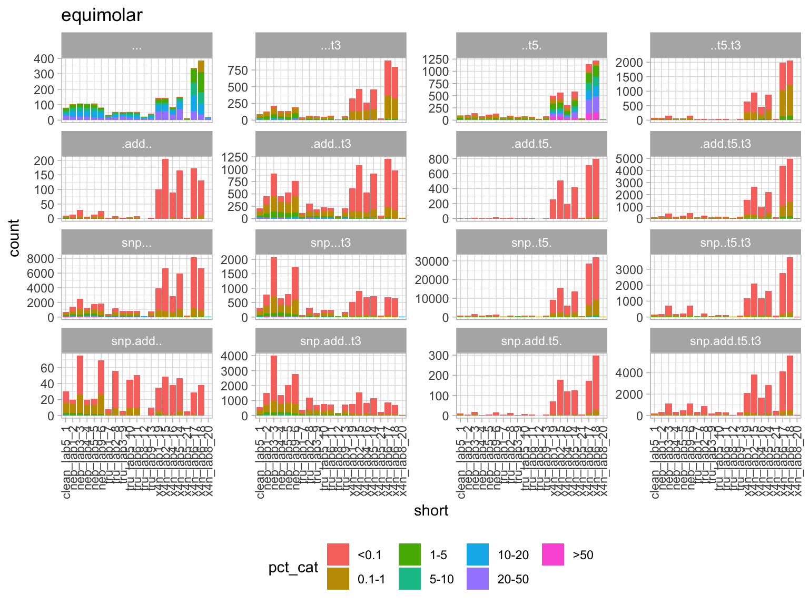

``` r
R> plasma %>% filter(ref_is_1 != 1) %>% group_by(short, mi_rna) %>% ggplot(aes(x = short, 
+     fill = pct_cat)) + geom_bar() + facet_wrap(~iso, nrow = 4, scales = "free_y") + 
+     theme(axis.text.x = element_text(angle = 90, hjust = 1, vjust = 0.5)) + 
+     ggtitle("plasma")
```

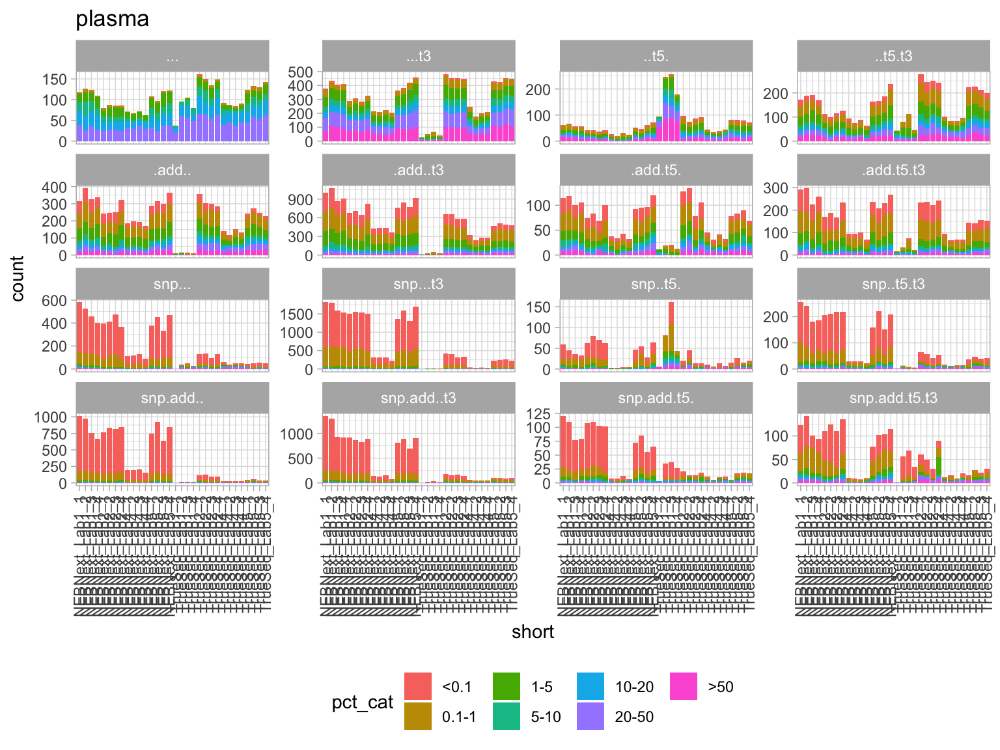
