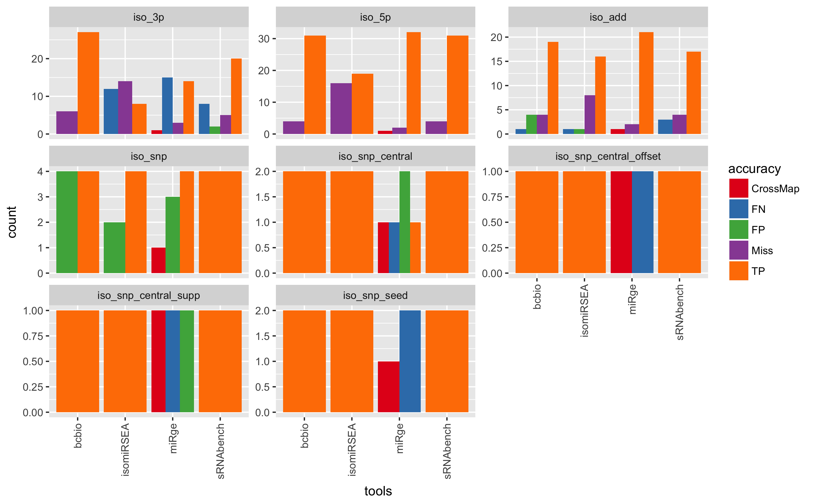
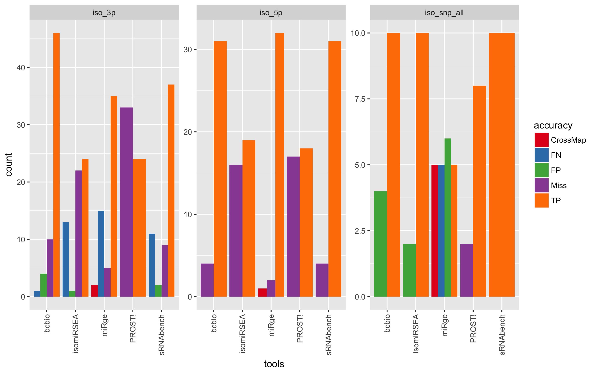

This comparison analysis is in beta version and number may change over time
until all the compatibility between tools and GFF format is finished.

Therefore, numbers are indicative and help to find possible bugs in the code.

Figures with the summary of the detected isomiRs are in `plot` folder.

This is the comparison with the synthetic data:

A simpler comparison is to considered any isomiR at 3' as iso_3p and
any isomiRs with snp as iso_snp_all:

To know which sequences doesn't agree with the synthetic data, use this file:
`all/summary.txt`:

* sample: file name related to the tool
* idu: unique sequence tag
* seq: sequence
* tag: `D` detected synthetic sequence in the file. `M` missed synthetic sequence in the file. `E` extra sequence not in synthetic data.
* same_mirna: whether miRNAs in the file is the same than in the synthetic data.
* iso_3p, iso_snp_central_supp, iso_snp_seed, iso_5p, iso_snp_central_offset, iso_add, iso_snp, iso_snp_central: `FP` when isomiRs is not in the synthetic data, but it is in the file for this sequence. `FN` when isomiRs is in the synthetic data, but it is NOT in the file for this sequence.`TN` when isomiRs is NOT in the synthetic data, and it is NOT in the file for this sequence. `TP` when isomiRs is in the synthetic data, but it is in the file for this sequence.

If you want to look for missed sequences for a specific tool, use sample to identify the tool and use `tag` to identify `M` values.